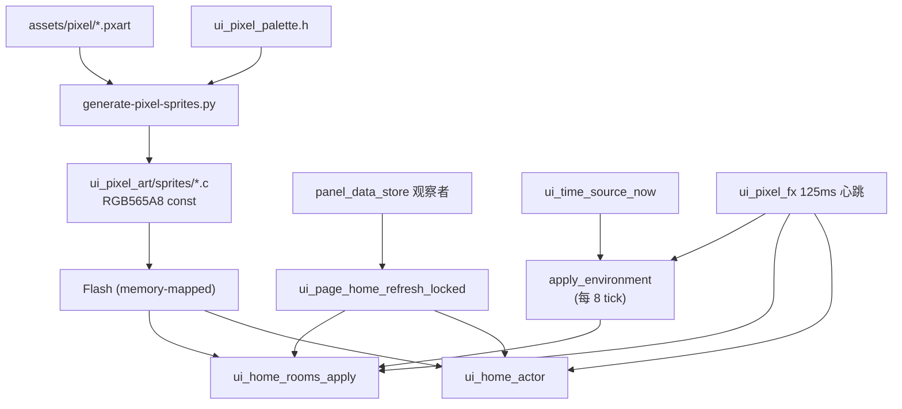

# ui-pixel-home-fancy Plan

## 1. 背景

首页（`ui_page_home.c`）之前是 984 行、约 200 个嵌套 `lv_obj` 的俯视平面图，被评价为「过于简陋」。诊断结论是问题不在面板刷新率，而在四件事：

- **没有像素栅格**：1 设备像素 = 1 美术像素，灯是 `14x14`、边框 `1~3px`、地板网格是 `1px` 细线。在 1024x600 上这只能读作「细线矢量方块」。
- **调色板失控**：全文约 40 个临时 hex，彼此没有色阶关系，整体发灰。
- **动效等于闪灯**：`ui_page_home_animation_cb` 周期 600ms（约 1.6 FPS），只做 `bg_opa` 切换和 ±2px 位移；±2px 在 4px 栅格上是亚像素，低帧率下必然读作「卡」。
- **构图限制天花板**：俯视图没有天空，昼夜/天气/月相/窗光这些最出效果的东西无处安放；房间只覆盖 `panel_entities.json` 12 个 group 中的 8 个（丢了拱门、客卫、主卫、衣帽间）。

## 2. 目标

- 用 4 设备像素 = 1 美术像素的栅格 + 固定 24 色调色板，把首页做成真正的像素艺术而不是矢量方块。
- 接受 8 FPS 的离散帧美学：不追平滑，把生命感放在**行为**上（角色被真实 HA 事件驱动地走动、睡觉、打盹），而不是帧率上。
- 覆盖全部 12 个 group。
- 昼夜、月相、天气、窗光这些时间相关效果必须**可在数十秒内回放验证**，不能依赖真实的 24 小时。

## 3. 范围

包含：

- 4px 栅格宏与固定调色板（`ui_pixel_palette.h`）
- ASCII 精灵资产管线（`.pxart` → RGB565A8 C 数组）
- 横向剖面小屋构图（天空带 / 6 间房 / HUD 侧栏）
- 125ms 全局心跳 + 分频器 + 脏区预算守卫
- 调色板循环、抖动光锥、窗光、天气粒子、昼夜/月相/视差、CRT 叠层
- 角色行为状态机 + 宠物 + 打字机对话框
- host 仿真器（SDL 窗口 + 无头 PNG 转储 + 虚拟时钟 + 脚本化事件）
- 回收 100KB 内部 RAM 并上调 LVGL 堆

不包含：

- 其他四个页面（Dashboard / Climate / Quick Modes / Energy）的视觉改造
- 触摸交互语义变更（点击房间的导航行为沿用原有 `ui_page_home_room_event`）
- 任何服务层（`ha_client` / `panel_data_store` / `weather_service`）的协议变更

## 4. 设计方案

### 4.1 目录影响

新增：

- `assets/pixel/*.pxart`：31 个 ASCII 精灵源文件
- `scripts/generate-pixel-sprites.py`：`.pxart` → `RGB565A8` C 数组，支持多帧 / Bayer 抖动 / 程序化生成 / `bake_scale`
- `scripts/pixel_palette.py`：解析 `ui_pixel_palette.h`，保证 C 与 Python 调色板同源
- `scripts/png_writer.py`：纯标准库 zlib PNG 编码器（环境里既无 Pillow 也无 pypng）
- `scripts/ppm_to_png.py`：仿真器 PPM 帧转 PNG，含 `--crop` / `--zoom` / `--sheet` 拼图
- `scripts/run-sim.sh`：一条命令完成「重生成精灵 → 构建 → 运行 → 转 PNG」
- `firmware/components/ui_pixel_art/`：生成的精灵 C 数组 + 头文件
- `firmware/components/ui_pages/ui_pixel_palette.h`
- `firmware/components/ui_pages/ui_pixel_fx.c` / `include/ui_pixel_fx.h`
- `firmware/components/ui_pages/ui_home_rooms.c` / `include/ui_home_rooms.h`
- `firmware/components/ui_pages/ui_home_actor.c` / `include/ui_home_actor.h`
- `firmware/components/ui_pages/ui_time_source.c` / `include/ui_time_source.h`
- `sim/`：host 仿真工程（`CMakeLists.txt`、`lv_conf.h`、`main.c`、`sim_ui_shell.c`、`shim/`、`fake/`）

修改：

- `firmware/components/ui_pages/ui_page_home.c`：重写
- `firmware/components/display_service/display_service.c`：`sw_rotate = false`
- `firmware/sdkconfig.defaults`：`CONFIG_LV_MEM_SIZE_KILOBYTES` 64 → 96
- `scripts/generate-ui-cjk-font.py`：追加新中文字符；字体源改为可回退到 component manager 缓存

### 4.2 模块拆解

- **`ui_pixel_palette.h`**：24 色，按用途组织成 4 级色阶（暗/基/亮/高光）。`UI_PX(n)` = `n * 4`，首页内所有坐标必须是它的整数倍。
- **资产管线**：美术在 1x 授权，运行时 `lv_image_set_scale(img, 1024)` + `lv_image_set_antialias(img, false)` 做 4x 最近邻放大。选 `RGB565A8` 而不是 indexed，因为软件渲染器不支持 I2/I4/I8，indexed 会被解码成 ARGB8888 占 `w*h*4` 字节 LVGL 堆——总共只有 160KB。`RGB565A8` 是 const flash 数组，零堆开销。
- **`ui_pixel_fx`**：单个 125ms `lv_timer` 作为全局心跳，每个效果声明分频器与相位。承载三类调度：任意回调、调色板循环、一次性精灵爆发。附带脏区预算守卫（每 tick 上限 `1024*50` 设备像素 = 一个 draw buffer stripe）。
- **`ui_home_rooms`**：6 间房的定义、状态聚合、外观应用；房屋外壳（屋顶 / 墙 / 楼板 / 地基 / 楼梯）。灯光锥用 3 帧阶梯淡入 / 2 帧收起，不用 `lv_anim`。
- **`ui_home_actor`**：行为状态机（呼吸 / 眨眼 / 4 帧行走 / 跨层楼梯 / 睡 / 打盹）、宠物滞后跟随、打字机对话框。所有姿态高度不同，统一以「地板线」为锚点。
- **`ui_time_source`**：时间间接层，替换 `time(NULL)`，让仿真器注入任意墙钟。
- **`sim/`**：跑同一套 `lv_draw_sw`、同样 `LV_COLOR_DEPTH 16`、同样 `1024*50` 单缓冲 partial render，因此最近邻放大质量、烘焙抖动的 RGB565 色带、`bg_image_tiled` 叠层观感都是像素级一致的。

### 4.3 数据流 / 控制流

时间相关效果由心跳驱动（`apply_environment` 每 8 tick 跑一次），HA 相关效果由 `panel_data_store` 观察者驱动。两条路径都收敛到 `ui_home_rooms_apply` / `ui_home_actor`，所以仿真器只要能供给虚拟时钟和假 store 就能确定性回放全部效果。

## 5. 实现任务

1. Phase 0 地基：调色板、栅格宏、资产管线、`ui_pixel_art` 组件。
2. Phase 0.5 仿真环境：`sim/` host 工程 + shim + 假 store + 虚拟时钟 + PNG 转储。
3. `ui_time_source` 时间间接层。
4. Phase 1 构图：横向剖面小屋，2 层 x 3 开间共 6 房，覆盖 12 个 group。
5. Phase 2 节拍：125ms 心跳 + 分频器 + 脏区预算守卫；调色板循环；CRT 扫描线叠层（Kconfig 开关）。
6. Phase 3 环境：昼夜四套抖动天空 + 真实月相 + 星星 + 三层视差 + 窗光 + 天气粒子池。
7. Phase 4 生命：角色行为状态机 + 宠物 + 打字机对话框。
8. Phase 5 事件果汁：灯开星芒 / 光锥阶梯淡入、灯关烟、空调冷波、场景符文、离线灰网。
9. 回收 RAM：`sw_rotate = false`，LVGL 堆 64 → 96KB。
10. 追加新中文到 `STATIC_UI_TEXT` 并重生成字库。

## 6. 测试方案

### 6.1 构建验证

- `cmake -S sim -B sim/build -G Ninja && ninja -C sim/build`：`-Wall -Wextra` 零 warning。
- `idf.py build`：目标固件构建通过（**待执行**，需要 ESP-IDF 环境）。

### 6.2 功能验证

以仿真器为主力回路：

- `scripts/run-sim.sh --mode dump --scenario`：回放 17 步脚本化事件（连接 → 逐间开灯 → 空调 → 雨 → 雪 → 雾 → 晴 → 逐间关灯 → 全暗睡觉 → 离线 → 恢复），逐帧核对事件果汁。
- `scripts/run-sim.sh --mode dump --frames 240 --start-hour 0 --clock-speed 2880`：30 秒回放 24 小时，核对天空四相、月相、太阳弧线、窗光位移、屋顶与远山的昼夜着色、室内环境光。
- `scripts/ppm_to_png.py --sheet`：把连续帧拼成一张接触印相，这是判断「离散帧读作故意的还是卡」的唯一办法。
- `scripts/generate-pixel-sprites.py --preview`：单张精灵放大预览，用于调光锥密度这类不需要跑 C 的迭代。

已通过的具体项：

- 24 小时回放：夜 → 晨 → 昼 → 昏 → 夜，天空、远山、屋顶、室内环境光全部随相位变化。
- 四种天气：雨（竖条 + 落地水花）、雪（半速下落 + ±1 px 摆动）、雾（三条抖动横带错速平移）、晴（太阳 4 帧光晕呼吸）；阴雨雪雾时太阳隐藏。
- 灯开：星芒 + 光锥 3 帧阶梯淡入 + 壁灯不均匀节奏闪烁 + 墙面染上灯光色温。
- 灯关：烟 + 光锥 2 帧收起 + 调色板循环停在 off 色。
- 角色：站立呼吸、眨眼、行走、跨层走楼梯、全屋熄灯去躺下、离线打盹；宠物滞后跟随。
- 对话框：打字机逐字显示 + 像素方块 `▼` 光标（不用 `LV_SYMBOL_DOWN`，它在 Montserrat fallback 里，用像素字体会出豆腐块）。

### 6.3 回归验证

- 其他四个页面未被改动；`sim_ui_shell.c` 只替换 `ui_pages.c` 的页面装配，`ui_pages.h` 接口未变。
- `ui_pixel_theme.h` 里原有的 `UI_PIXEL_COLOR_*` 保留，其他页面不需要改。
- 中文字库重生成后共 165 个字形，包含原有全部字符 + 新增房间名与对话文案。

### 6.4 硬件/联调验证

仿真器测不出来、必须实机确认的：

- 真实帧耗时（host CPU 快几个数量级，耗时只能在实机上量）。脏区**面积**本身与平台无关，已在仿真器全量回放里量到：`VERIFY: fx ... peak=6368px budget=51200px denied=0`，最坏单 tick 只占一个 stripe 的 12%，无一次因预算被拒。该日志每 8 秒一条（仅在 Home 可见时），实机可直接复用来核对。
- 内部 RAM 实际占用。`display_service` 新增 `VERIFY:display:draw_buffers:cost=...KB sw_rotate=off`，应约等于 100KB（一个 stripe）而不是 200KB。
- flash 占用：`size libui_pixel_art.a` 合计 81827 B（80 KB），`.data`/`.bss` 均为 0，即全部 const 走 flash 内存映射、零 LVGL 堆；低于 150 KB 预算。整个固件 0x158f90（1.35 MB），`factory` 分区仍余 55%，OTA 两槽够用。
- EK79007 面板的实际色彩、gamma 与亮度观感——仿真器同色深不等于同观感。
- `sw_rotate = false` 后镜像方向未变（由 `esp_lcd_panel_mirror()` 硬件完成）。
- 触摸命中精度。
- 并发正确性：仿真器里 `portENTER_CRITICAL` 是空实现，不会暴露 LVGL 锁与 HA 回调任务之间的竞争。

## 7. 风险

- **`RGB565A8` 在 `lv_draw_sw_transform` 缩放路径上的支持度**是整条管线的地基。已在仿真器里确认 4x + `antialias=false` 清晰锐利（同渲染器同色深），但耗时仍需实机复核。若不可接受，回退顺序：`ARGB8888` → 管线内 `bake_scale=4`（flash 换 CPU）。
- LVGL 实际解析到 9.5.0 而非 `idf_component.yml` 写的 `^9.4.0`（缓存里只有 9.5.0）。若要锁 9.4 需改成 `~9.4.0` 并联网重拉。
- 构建通过、仿真器好看，都不等于实机好看。色彩与亮度必须在面板上复核。
- shim 层有「桩得太像、掩盖真实并发问题」的风险，见 6.4。
- 美术工作量：31 个精灵已成型，但风格统一性只在仿真器里评审过。

## 8. 完成定义

- 仿真器里 24 小时回放与 17 步事件脚本全部符合预期，无残留/闪烁/错位。
- host 构建 `-Wall -Wextra` 零 warning。
- `idf.py build` 通过，实机烧录后 `VERIFY:display:draw_buffers` 与 `VERIFY: fx ... peak` 两条日志在预算内。
- 中文无豆腐块。

## 9. review 准备

已完成的实现项：

- Phase 0 / 0.5 / 1 / 2 / 3 / 4 / 5 全部落地
- `sw_rotate = false` + LVGL 堆 96KB
- 字库重生成（165 字形）
- `ui_pixel_theme.h` 改为对 `ui_pixel_palette.h` 的 alias，调色板单一来源
- 符文飞行（`ui_pixel_fx_fly_once`）+ 落地房间描边闪 2 帧
- 房间按压反馈：整体下移 1 美术像素，单帧无补间

已完成的验证项：

- host 构建零 warning
- `idf.py build` 通过（esp32p4），零 warning
- 24 小时昼夜回放
- 17 步事件脚本回放
- 四种天气
- 精灵 flash 占用实测 80 KB、零 RAM
- 脏区预算实测最坏 6368px / 51200px，denied=0

待用户重点查看的文件：

- `firmware/components/ui_pages/ui_page_home.c`：构图与环境层
- `firmware/components/ui_pages/ui_home_rooms.c`：6 间房与外壳
- `firmware/components/ui_pages/ui_pixel_fx.c`：心跳、分频、调色板循环、脏区预算
- `firmware/components/ui_pages/ui_home_actor.c`：行为状态机
- `assets/pixel/*.pxart` + `scripts/generate-pixel-sprites.py`：资产管线
- `sim/`：仿真工程

未完成：

- 实机烧录校准（本环境无硬件）：见 6.4，需核对 `VERIFY:display:draw_buffers`、`VERIFY: fx ... peak`、面板色彩与触摸命中。
