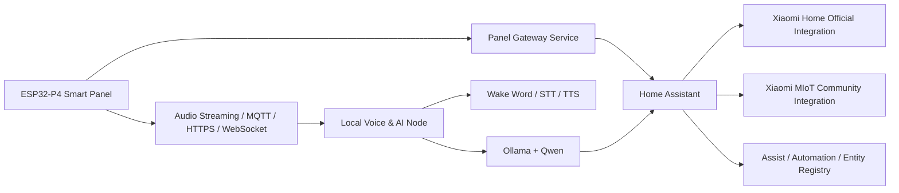

# ESP32-P4 EVB Home Assistant Smart Panel 技术方案

## 1. 项目目标

基于 `ESP32-P4 EVB` 制作一款面向家庭场景的 `Home Assistant Smart Panel`，具备以下能力：

- 接入 `Home Assistant`，作为家庭智能中台
- 支持接入 `米家 / Xiaomi Home / MIoT` 生态
- 支持本地语音交互
- 支持本地 LLM 对话
- 具备原生、高质量、可维护的数据展示与交互能力
- 能长期维护、支持 OTA、便于扩展到自定义硬件

本方案的核心结论：

- `ESP32-P4 EVB` 非常适合做 `高质量触控面板 + 音频前端 + 本地离线命令`
- `通用 LLM` 不应运行在 `ESP32-P4` 上，而应运行在局域网边缘节点
- `米家接入` 不应由面板直连，应统一经 `Home Assistant` 聚合

## 2. 能力边界判断

### 2.1 ESP32-P4 适合做什么

根据 Espressif 官方资料，`ESP32-P4` 具备：

- 双核 `RISC-V`，最高 `400 MHz`
- `768 KB` 片上 SRAM
- 支持外部 `PSRAM`
- `MIPI-CSI / MIPI-DSI`
- `PPA + 2D-DMA`
- `I2S / USB OTG / Ethernet / SDIO`
- 面向 `HMI`、视觉与语音终端场景

这意味着它非常适合：

- 原生 GUI 渲染
- 流畅的卡片式数据展示
- 触摸交互
- 本地音频采集/播放
- 离线唤醒词与固定命令词

参考：

- ESP32-P4 官方页: <https://www.espressif.com/en/products/socs/esp32-p4>
- ESP32-P4 Function EV Board User Guide: <https://documentation.espressif.com/esp32-p4_function_ev_board_user_guide_en.pdf>

### 2.2 ESP32-P4 不适合做什么

不适合在板上运行通用本地 LLM：

- 现代对话模型即便是 `0.5B` 量级，4-bit 权重也通常需要数百 MB 级内存
- 还需要 KV cache、运行时 buffer、工具调用上下文
- 实际工程中无法在 `ESP32-P4 EVB` 上获得可用的对话体验

因此“本地 LLM”在本项目里应定义为：

- `局域网本地部署`
- 非云端
- 由家庭内 `x86/N100/NUC/NAS/GPU 主机` 运行

参考：

- Qwen 2.5 文档: <https://qwen.readthedocs.io/en/v2.5/index.html>
- Ollama: <https://ollama.com/>

## 3. 总体架构



### 3.1 三层分工

#### A. 面板端：ESP32-P4 EVB

职责：

- UI 渲染
- 触摸输入
- 页面导航
- 本地缓存
- 麦克风采集/扬声器播放
- 本地唤醒词与离线固定命令
- OTA
- 网络连接与设备自检

不负责：

- 直接接米家云
- 直接理解 Home Assistant 全量实体语义
- 直接运行通用 LLM

#### B. 中台：Home Assistant

职责：

- 统一设备模型
- 自动化
- 实体/区域/场景管理
- 米家集成
- Assist 能力暴露
- 面板数据源聚合

#### C. AI/语音边缘节点

职责：

- 唤醒词服务或增强型唤醒词
- STT
- TTS
- LLM 推理
- 工具调用/实体选择优化

建议部署形态：

- `Intel N100 mini PC`
- `NUC`
- `NAS Docker`
- 有更高要求时使用 `NVIDIA GPU`

## 4. 推荐技术栈

## 4.1 面板固件主栈

- `ESP-IDF`
- `C/C++`
- `FreeRTOS`
- `esp_lcd`
- `LVGL`
- `ESP32_Display_Panel`
- `ESP-BSP`

推荐理由：

- `ESP-IDF` 对 `ESP32-P4` 支持最完整
- `LVGL` 是 MCU 图形领域最主流、最成熟、维护最稳定的选项
- 板级显示/触摸驱动优先复用 Espressif 生态

参考：

- ESP-IDF: <https://github.com/espressif/esp-idf>
- LVGL: <https://github.com/lvgl/lvgl>
- ESP32_Display_Panel: <https://github.com/esp-arduino-libs/ESP32_Display_Panel>
- ESP-BSP: <https://github.com/espressif/esp-bsp>

## 4.2 UI/HMI 组织方式

推荐：

- 底层用 `LVGL`
- 参考 `ESP-Brookesia` 的应用组织思想
- 不把产品架构完全绑定到 `ESP-Brookesia`

原因：

- `ESP-Brookesia` 很适合快速原型与 UI 组织借鉴
- 但长期产品维护更适合“自定义业务框架 + LVGL 稳定底座”

参考：

- ESP-Brookesia: <https://github.com/espressif/esp-brookesia>

## 4.3 米家接入

推荐顺序：

1. `XiaoMi/ha_xiaomi_home`
2. `al-one/hass-xiaomi-miot`

建议策略：

- 优先使用官方 `ha_xiaomi_home`
- 对官方尚未覆盖的设备，用 `hass-xiaomi-miot` 补充
- 面板只面向 HA，不直接面向米家

关键事实：

- 官方集成支持 OAuth、MIoT 设备导入、多账号
- 官方仓库明确说明：部分设备支持 `local mode`，否则控制走云
- 第三方 `hass-xiaomi-miot` 在设备覆盖上通常更强，但维护风险高于官方

参考：

- Xiaomi official integration: <https://github.com/XiaoMi/ha_xiaomi_home>
- Xiaomi MIoT community integration: <https://github.com/al-one/hass-xiaomi-miot>

## 4.4 语音与 LLM

### 面板端

- `ESP-SR`
- `AFE`
- `WakeNet`
- `MultiNet`

适合：

- 唤醒词
- 噪声处理
- 回声消除
- 固定命令词

参考：

- ESP-SR: <https://github.com/espressif/esp-sr>
- ESP-SR for ESP32-P4: <https://docs.espressif.com/projects/esp-sr/en/latest/esp32p4/index.html>

### 局域网语音节点

推荐组合：

- 唤醒词：`openWakeWord` 或 HA 官方 wake word 流程
- STT：`Whisper / faster-whisper`
- TTS：`Piper`
- 对话模型：`Ollama + Qwen`

参考：

- openWakeWord: <https://github.com/dscripka/openWakeWord>
- faster-whisper: <https://github.com/SYSTRAN/faster-whisper>
- whisper.cpp: <https://github.com/ggml-org/whisper.cpp>
- Piper: <https://github.com/rhasspy/piper>
- Ollama: <https://github.com/ollama/ollama>

### Home Assistant 官方语音路径

Home Assistant 官方资料已经给出非常清晰的本地语音架构：

- 卫星设备持续采样音频
- 将音频发到 Home Assistant 或外部 Wyoming 服务
- 支持本地 STT/TTS
- `Whisper` 在 `Raspberry Pi 4` 上约 `8 秒`
- 在 `Intel NUC` 上可到 `1 秒以内`

这直接说明：

- 低算力边缘设备适合做 satellite
- 强算力主机适合做本地 STT/LLM

参考：

- Local voice assistant: <https://www.home-assistant.io/voice_control/voice_remote_local_assistant/>
- Wake word architecture: <https://www.home-assistant.io/voice_control/about_wake_word/>
- Ollama integration: <https://www.home-assistant.io/integrations/ollama/>

## 5. 推荐部署形态

## 5.1 最推荐

### 面板

- `ESP32-P4 EVB` 原型板
- 电容触摸屏
- 双麦或线性阵列麦克风
- 扬声器 + I2S 放大器
- Wi‑Fi 伴生芯片或外部联网方案

### 中台

- `Home Assistant OS`

### AI 节点

- `Intel N100 mini PC`
- `16 GB RAM`
- `512 GB SSD`

适合：

- `Whisper small/base`
- `Piper`
- `Qwen2.5:7b`

### 为什么是 N100

- 成本低
- 功耗低
- 可 24x7 运行
- 对家庭本地语音和小中型本地 LLM 足够实用

## 5.2 更高规格

- `Intel Core i5/i7 NUC`
- 或 `RTX 3060/4060` 级独显主机

适合：

- 更快 ASR
- 更大模型
- 多轮对话更稳
- 工具调用准确率更高

## 6. 软件模块拆分

建议把面板固件拆成以下模块：

```text
panel-firmware/
  app/
    app_main/
    boot/
    settings/
  board/
    lcd/
    touch/
    audio/
    backlight/
    storage/
  ui/
    theme/
    widgets/
    pages/
      home/
      room/
      climate/
      security/
      energy/
      voice/
      settings/
  domain/
    entities/
    scenes/
    alerts/
    dashboards/
  gateway/
    mqtt/
    http/
    websocket/
    sync/
  voice/
    wakeword/
    command/
    stream/
    player/
  system/
    ota/
    diagnostics/
    logger/
    watchdog/
```

模块边界原则：

- `board` 只关心硬件
- `ui` 只关心展示与交互
- `domain` 只关心家庭模型
- `gateway` 只关心通讯
- `voice` 只关心音频链路
- `system` 只关心运维与稳定性

## 7. 面板与 Home Assistant 的接口策略

不要让面板直接消费 Home Assistant 的全量实体模型。

建议增加一个 `Panel Gateway Service`，可以有两种实现路径：

### 方案 A：直接在 Home Assistant 内实现

通过以下手段输出面板需要的数据：

- `REST sensors`
- `Template sensors`
- `MQTT`
- `WebSocket API`
- `custom integration`

优点：

- 部署少
- 集成紧密

缺点：

- 业务复杂后，HA 配置会越来越重

### 方案 B：旁路网关服务

单独实现一个轻量服务，例如：

- `Python FastAPI`
- `Node.js NestJS / Fastify`

职责：

- 聚合 HA 实体
- 抽象出面板页模型
- 做缓存、节流、鉴权、订阅
- 接 AI 节点

优点：

- 架构清晰
- 易维护
- 便于后续支持多个面板/多个型号

缺点：

- 多一层服务

结论：

- 原型期可先走 `方案 A`
- 若目标是产品化，建议尽快切到 `方案 B`

## 8. 通信协议草案

推荐混合协议：

- `MQTT`：状态、事件、轻量命令
- `HTTPS`：配置与静态拉取
- `WebSocket`：页面级实时推送

## 8.1 设备上线握手

设备启动后：

1. 获取网络
2. 上报设备信息
3. 获取配置
4. 获取首页模型
5. 建立订阅

示例：

```json
{
  "device_id": "panel-livingroom-01",
  "fw_version": "0.1.0",
  "hw_version": "esp32-p4-evb",
  "screen": {
    "width": 720,
    "height": 1280
  },
  "audio": {
    "mic": 2,
    "speaker": true
  },
  "features": {
    "wakeword_local": true,
    "offline_command": true,
    "llm_stream": true
  }
}
```

## 8.2 首页模型

面板不自己拼实体，应由服务端下发页面模型：

```json
{
  "page": "home",
  "title": "客厅",
  "sections": [
    {
      "type": "weather",
      "data": {
        "temperature": 23.5,
        "condition": "cloudy",
        "humidity": 62
      }
    },
    {
      "type": "quick_actions",
      "data": [
        { "id": "scene_movie", "label": "观影模式", "icon": "movie" },
        { "id": "scene_sleep", "label": "睡眠模式", "icon": "moon" }
      ]
    },
    {
      "type": "energy_summary",
      "data": {
        "today_kwh": 8.3,
        "month_kwh": 216.4
      }
    }
  ]
}
```

## 8.3 命令模型

```json
{
  "request_id": "cmd_20260329_001",
  "source": "panel-livingroom-01",
  "type": "entity_action",
  "entity_id": "light.living_room_main",
  "action": "turn_on",
  "data": {
    "brightness": 180
  }
}
```

## 8.4 语音会话模型

```json
{
  "session_id": "voice_abc123",
  "device_id": "panel-livingroom-01",
  "wakeword": "你好小屏",
  "mode": "assist_llm",
  "audio_stream": {
    "codec": "pcm16",
    "sample_rate": 16000,
    "channels": 1
  }
}
```

## 9. UI 产品设计建议

不要做“把 Lovelace 网页塞进 MCU 屏幕”的方案。

推荐做原生信息架构：

- 首页：天气、时间、快捷场景、门锁/告警摘要、家庭概览
- 房间页：灯光、空调、窗帘、传感器
- 能耗页：日/周/月趋势、分路能耗、峰谷提示
- 安防页：门窗状态、人体感应、摄像头占位与事件摘要
- 语音页：当前转写、TTS 回复、会话状态、最近执行动作
- 设置页：网络、麦克风、亮度、唤醒词、OTA、调试

视觉建议：

- 优先卡片布局，不做通用表格
- 采用“低密度 + 大字号 + 强状态色”
- 用动态图表而不是纯数字堆叠
- 控件风格统一，降低切页认知负担

## 10. 主流备选路线与取舍

## 10.1 方案一：ESPHome + HA 原生语音卫星

优点：

- 与 HA 贴合度高
- 开发快
- 语音链路成熟

缺点：

- 对 `ESP32-P4 + 高级 GUI` 的掌控力不足
- 不适合做高完成度原生 smart panel 产品

结论：

- 适合验证语音链路
- 不适合作为最终面板产品基座

## 10.2 方案二：网页面板

例如：

- Android 平板 + Lovelace
- Linux 屏幕 + 浏览器 kiosk

优点：

- 实现最快
- 生态现成

缺点：

- 不是 `ESP32-P4` 方向
- 功耗、启动速度、硬件一体化、离线控制都不理想

结论：

- 可做竞品对照
- 不符合本项目硬件目标

## 10.3 方案三：ESP32-P4 原生面板

优点：

- 产品感强
- 启动快
- 功耗低
- 深度定制
- 可移植到后续自研硬件

缺点：

- 前期工程量更大
- 需要更严格的软件分层

结论：

- 这是本项目的推荐终局方案

## 11. 关键风险

## 11.1 米家接入风险

- 官方集成并非全量设备都完美支持
- 不同地区、不同网关、不同固件行为存在差异
- 局域网控制能力受网关/设备能力限制

应对：

- 以 `HA 聚合` 为唯一入口
- 设备清单先做支持矩阵
- 官方集成优先，第三方补位

## 11.2 语音体验风险

- 唤醒率
- 误唤醒
- STT 延迟
- TTS 首包时间

应对：

- 板端先做 `ESP-SR` 降噪与唤醒
- STT 与 LLM 放到强算力节点
- 对家控命令做 close-ended fallback

## 11.3 UI 性能风险

- 动效与图表过重会吃掉 RAM 和刷新带宽

应对：

- 统一页面模板
- 图表组件轻量化
- 资源分级缓存

## 11.4 可维护性风险

- 直接耦合 HA 实体会导致固件不断返工

应对：

- 固件只消费“面板模型”
- 实体映射与卡片编排在服务端完成

## 12. 12 周开发排期

## 阶段 1：底座验证（第 1-2 周）

- 跑通 `ESP-IDF`
- 屏幕点亮
- 触摸驱动
- LVGL 基础页面
- 音频输入输出
- Wi‑Fi/网络链路

交付：

- 基础板级 demo

## 阶段 2：通信与页面模型（第 3-4 周）

- 定义设备注册协议
- 打通 MQTT/HTTP/WebSocket
- 首页、房间页模型
- 状态同步与命令回写

交付：

- 面板能稳定显示 HA 数据并控制设备

## 阶段 3：米家与中台聚合（第 5-6 周）

- 配置 `ha_xiaomi_home`
- 补充 `hass-xiaomi-miot`
- 建立实体分类与卡片模型转换
- 完成 Panel Gateway 初版

交付：

- 面板可消费米家设备在 HA 中暴露的实体

## 阶段 4：语音链路（第 7-8 周）

- ESP-SR 唤醒
- 音频流上传
- HA Assist / Wyoming / Whisper / Piper 联调
- 固定命令词 fallback

交付：

- 本地唤醒 + 本地 STT/TTS

## 阶段 5：LLM 对话（第 9-10 周）

- Ollama + Qwen
- Home Assistant Ollama conversation agent
- 对话页 UI
- 工具调用白名单

交付：

- 可执行家控对话与基础闲聊

## 阶段 6：打磨与发布（第 11-12 周）

- OTA
- 崩溃恢复
- 启动优化
- UI 动效打磨
- 日志与诊断

交付：

- 可演示版本 `v0.9`

## 13. 最终推荐决策

如果目标是“做出一个专业、好看、可维护、后续可产品化的 smart panel”，推荐定版如下：

- 面板端：`ESP-IDF + LVGL + ESP-SR`
- 智能家居中台：`Home Assistant`
- 米家接入：`ha_xiaomi_home` 为主，`hass-xiaomi-miot` 为辅
- AI 语音节点：`Whisper/faster-whisper + Piper + Ollama`
- 对话模型：优先 `Qwen` 系列
- 通信架构：`MQTT + HTTPS/WebSocket`
- 长期维护策略：`Panel Gateway Service` 抽象页面模型

这套方案的优势是：

- 工程边界清晰
- 风险可控
- 可以从 EVB 原型平滑迁移到自研硬件
- 不会把未来维护成本锁死在某个第三方项目上

## 14. 推荐参考项目

- ESP-IDF: <https://github.com/espressif/esp-idf>
- ESP-Brookesia: <https://github.com/espressif/esp-brookesia>
- ESP-BSP: <https://github.com/espressif/esp-bsp>
- ESP32_Display_Panel: <https://github.com/esp-arduino-libs/ESP32_Display_Panel>
- LVGL: <https://github.com/lvgl/lvgl>
- ESP-SR: <https://github.com/espressif/esp-sr>
- Xiaomi Home Integration: <https://github.com/XiaoMi/ha_xiaomi_home>
- Xiaomi MIoT Integration: <https://github.com/al-one/hass-xiaomi-miot>
- openWakeWord: <https://github.com/dscripka/openWakeWord>
- Piper: <https://github.com/rhasspy/piper>
- faster-whisper: <https://github.com/SYSTRAN/faster-whisper>
- whisper.cpp: <https://github.com/ggml-org/whisper.cpp>
- Ollama: <https://github.com/ollama/ollama>

