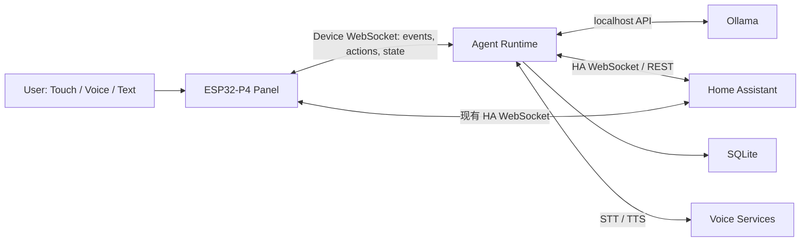

# P4 Home 本地 LLM Agent 化架构说明（审查优化版）

> Status: Current Architecture Baseline
> Target Project: `shenqislx/p4home`
> Target Stage: M7 / Local Voice, AI & Agent Runtime
> Review Date: 2026-08-15
> Execution Index: [docs/plans/README.md](./plans/README.md)

## 1. 结论

原方案的长期方向成立，以下原则建议保留：

- 通用 LLM 不运行在 ESP32-P4 上；
- LLM Provider 与 Agent Runtime 分离；
- LLM 只调用高层语义 Tool，不操作坐标和动画帧；
- World State 由真实执行层提供，不能依赖模型记忆；
- 动作必须有开始、完成、失败和取消反馈；
- Memory、Context 与实时 World State 分离；
- 自主行为由事件低频触发，禁止持续轮询模型。

但原方案不能直接作为实施规格。需要重点修正六点：

1. `Agent Runtime` 不应整体宣称“业务无关”，应拆成通用内核与 P4 Domain Adapter；
2. Home Assistant 控制应由 Agent Runtime 直连 HA，不应绕经 P4；
3. 当前角色能力只到“房间级移动”，第一版不能以“去沙发坐下”为验收；
4. P4 与 Agent 的 WebSocket 需要明确协议、幂等、重连、超时和状态对账；
5. M7 的语音链路、权限安全、可观测性和降级策略不能留到最后补；
6. 当前本地构建环境需先恢复可重复构建，再增加新的固件组件。

推荐路线不是一次建成完整 Harness，而是：

```text
可重复构建
→ 协议契约与 Mock
→ 文本 Agent
→ P4 房间级动作闭环
→ 对象级 World Runtime
→ HA Tool
→ 语音
→ Memory
→ Autonomy
```

## 2. 当前项目与环境基线

本节只记录本次审查实际检查到的状态，避免把规划项写成已具备能力。

### 2.1 ESP32-P4 固件

| 项目 | 当前状态 | 对 Agent 化的影响 |
|---|---|---|
| 固件基线 | ESP-IDF v5.5.4 | M7 不应同步升级 IDF，避免扩大变量 |
| UI | LVGL 9.5.0、1024×600、RGB565 | 继续作为渲染层，不承载 Agent 推理 |
| 动效 | 共享 8 FPS 像素动效时钟 | Agent 只发语义动作，不介入逐帧控制 |
| 网络 | ESP32-C6 ESP-Hosted，Wi-Fi modem sleep 开启 | 新 WebSocket 必须容忍 DTIM 延迟、断线和重连 |
| HA | 已有 WebSocket 订阅、状态回刷和同步 `call_service` | 不再另造一条“Agent → P4 → HA”控制链 |
| Character | `idle / walk / sleep / doze`，支持按房间移动和对话气泡 | 暂无 `sit / look_at / interact / object anchor` |
| Gateway | 注册、状态快照、单条 command mailbox 骨架 | 单邮箱不足以承载 Agent Action Queue |
| 语音 | `audio_service`、`sr_service` 骨架存在；默认关闭 SR 与音频自检 | M7 需单独恢复并压测音频链路 |
| 存储 | 16 MiB Flash，32 MiB PSRAM | 足够新增轻量协议层，不适合存 Agent Memory |
| 分区 | 每个 app 分区 3 MiB，另有 storage/model 分区 | 协议与执行层有空间，仍需保留 OTA/资源余量 |

2026-08-15 使用独立 `SDKCONFIG` 与全新 build 目录完成干净构建，map 显示：

- 应用 image 统计为 `1,437,384 bytes`，生成的 `.bin` 为 `1,437,792 bytes`；
- Flash 中 `.text + .rodata` 为 `1,353,154 bytes`；
- 静态 DIRAM 使用 `296,378 / 576,464 bytes`，约 `51.41%`；
- 当前数字不包含完整运行期峰值，不能据此推断网络、LVGL、音频同时运行时的最低剩余堆。

因此结论是：Flash 和 PSRAM 余量不是当前主要矛盾，内部 RAM、任务栈、网络 buffer 和运行期碎片才是固件侧主要风险。

项目里程碑文档仍将 M6 标记为进行中：`call_service` 已实现，但真实设备点击、状态回刷和米家闭环尚未完成最终验收。因此 Phase 0/1 可以先做不侵入固件主线的契约、Mock 与 Agent Runtime；Phase 2 开始修改 P4 网络和执行层前，应先关闭 M6，或至少明确隔离验证范围，避免同时调试两条实时控制链。

### 2.2 本地 AI 节点

本次检查到的开发机为：

- Mac mini，Apple M4 Pro，14 核，64 GB 统一内存；
- Node.js `v22.16.0`；
- Python `3.14.3`；
- Ollama CLI `0.32.6` 已安装，但服务未运行，未确认本地已有模型。

该机器足以作为开发期 Agent/LLM 节点。Ollama 官方当前列出的 `qwen3:30b` 默认量化体积约 19 GB，64 GB 统一内存具备装载空间，但“能装载”不等于“满足交互延迟”。模型必须通过本项目的工具调用准确率和端到端延迟基准选择。

### 2.3 构建环境状态

Phase 0 已补齐 ESP-IDF v5.5.4 manifest 要求的
`riscv32-esp-elf esp-14.2.0_20260121`，并在不读取旧 CMake cache、使用独立
`SDKCONFIG` 的条件下完成一次全量构建。生成配置确认：

- `SLAVE_IDF_TARGET_ESP32C6=y`；
- `ESP_HOSTED_CP_TARGET_ESP32C6=y`；
- `ESP_HOSTED_P4_DEV_BOARD_FUNC_BOARD=y`；
- `ESP_HOSTED_SDIO_HOST_INTERFACE=y`；
- 配置日志没有 unknown Kconfig 或 attempt-to-assign 警告。

构建环境阻塞已经解除。精确提交 `b0aa443374360324a4a27dcc5a38c0a1849b0b45` 已在自托管
ESP32-P4 runner 完成构建、烧录与 7,200 秒串口采集；HA 全程 READY 且零重连、Pixel Home
heartbeat 稳定，heap/stack 无趋势性恶化，也未出现重启、panic、watchdog 或断言失败。workflow、
artifact 完整性与功能判定均已分别通过，因此可以把本候选的静态构建结论扩大为两小时实机稳定性
基线。正式证据见 Phase 0 计划中的
[run 31875576865](https://github.com/shenqislx/p4home/actions/runs/31875576865)。本阶段不更新
ESP-IDF 或 managed component 版本。

## 3. 优化后的系统边界



### 3.1 为什么 HA Tool 不应经过 P4

Agent Runtime 与 HA 都运行在高资源节点或局域网服务侧，直接调用 HA 有四个好处：

- 不占用 P4 的额外 JSON、任务栈和网络 buffer；
- P4 离线时，Agent 仍可执行家居任务；
- HA 继续作为物理家庭状态的唯一权威源；
- P4 通过现有 `state_changed` 订阅自然回刷，不需要 Agent 手工同步 UI。

P4 Tool 只负责 P4 独有能力，例如角色、屏幕、触摸、设备音频和面板状态。

### 3.2 四类权威状态

| 状态 | 权威来源 | 是否持久化到 Agent DB |
|---|---|---|
| 角色位置、姿态、当前动画 | P4 `world_service` | 只保存事件/快照用于诊断，不作为恢复真值 |
| 灯光、空调、传感器 | Home Assistant | 可缓存，HA 仍是真值 |
| 会话、任务、Action 关联 | Agent Runtime | 是 |
| 用户偏好与长期事实 | Memory Store | 是，必须带来源、置信度和更新时间 |

## 4. 模块拆分

### 4.1 Agent 节点

“Runtime 业务无关”应调整为“Core 业务无关，Adapter 明确业务相关”。

```text
agent/
├── apps/
│   └── runtime/               # 进程入口、配置、健康检查
├── packages/
│   ├── core/                  # run loop、session、tool runtime、budget
│   ├── contracts/             # Tool 与 Device Protocol schema
│   ├── provider-ollama/       # Ollama adapter
│   ├── domain-p4home/         # P4 tools、world projection、policy
│   ├── transport-panel-ws/    # P4 WebSocket server
│   ├── transport-ha/          # HA client 与 entity/service allowlist
│   ├── storage-sqlite/        # session、run、action、memory
│   └── observability/         # structured logs、metrics、trace id
└── tests/
    ├── contract/
    ├── integration/
    └── scenarios/
```

推荐主 Runtime 使用 TypeScript + Node.js 22：

- 当前环境已具备 Node.js 22；
- Ollama 提供官方 JavaScript/TypeScript 调用方式；
- WebSocket、JSON Schema、Zod 类型校验和前后端调试链较直接；
- 可避免把 Runtime 绑定到当前系统 Python 3.14 的生态兼容状态。

Whisper/faster-whisper/Piper 若使用 Python，建议作为独立进程或容器，并固定经过验证的 Python 3.11/3.12 环境，不与 ESP-IDF Python 环境混用。

### 4.2 P4 固件

不建议按原文新建模糊的 `firmware/ui`、`firmware/world` 顶层目录。当前仓库已经稳定采用 IDF component 结构，应继续沿用：

```text
firmware/components/
├── agent_transport/       # Device WebSocket、协议编解码、重连
├── world_service/         # 角色真值、动作队列、动作状态机
├── ui_pages/              # 只渲染 world snapshot 与动画结果
├── gateway_service/       # 保留诊断快照；逐步退役单命令邮箱
├── ha_client/             # 保持现有 P4 UI 的 HA 读写链
└── voice_stream/          # 后续音频上行、TTS 下行
```

需要把当前 `ui_home_actor.c` 中的“状态决定”和“LVGL 渲染”逐步拆开：

- `world_service` 持有角色 `room/activity/action_id`；
- `action_executor` 负责路径、时序、取消与完成条件；
- `ui_home_actor` 只把状态渲染成 sprite 与动画；
- 现有“断线打盹、全屋熄灯去睡觉”等规则先保留为本地 fallback policy，后续再决定是否由 Autonomy 替代。

## 5. Agent 核心对象模型

原方案只强调 Session，仍不足以描述长任务。建议固定以下对象：

```text
AgentProfile  人格、系统指令、可用工具与权限
Session       一段连续对话
Run           一次用户/事件触发的 Agent 执行
ToolCall      一次工具请求
Action        在外部世界中持续一段时间的执行
Event         可观察事实
Memory        可跨 Session 检索的长期事实
```

关键关系：

- 一个 Session 有多个 Run；
- 一个 Run 最多产生有限次 ToolCall；
- ToolCall 可立即完成，也可创建异步 Action；
- Action 的最终状态通过 Event 返回；
- Session 结束不代表尚在执行的 Action 可以失去归属。

## 6. Agent Loop：先简单、可预算、可中断

MVP 不需要单独的“复杂 Planner 服务”。先实现有预算的 ReAct/tool loop：

```text
Trigger
→ Build bounded context
→ Model decision
→ Direct response | Tool call
→ Validate policy and schema
→ Execute / wait for result
→ Append observation
→ Continue or finish
```

每个 Run 必须有硬限制：

- 最大工具轮次：建议初期 `4`；
- 最大 wall-clock deadline：按交互类型配置；
- 同一工具连续相同参数调用去重；
- 支持用户取消和高优先级事件中断；
- 模型输出必须通过 JSON Schema 校验；
- 超预算时给出明确失败，而不是无限继续推理。

只有当场景确实需要“跨数分钟、可恢复、多分支计划”时，再增加显式 Planner 和持久化 Plan graph。

## 7. Model Provider 需要比 `chat()` 更完整

建议接口至少包含：

```typescript
interface ModelProvider {
  capabilities(): Promise<ModelCapabilities>;
  generate(request: ModelRequest, signal: AbortSignal): Promise<ModelResponse>;
  stream?(request: ModelRequest, signal: AbortSignal): AsyncIterable<ModelChunk>;
}
```

`ModelCapabilities` 至少描述：

- tool calling；
- structured output；
- streaming；
- thinking/reasoning 开关；
- context limit；
- 并行 tool call 支持；
- cancellation。

Runtime 启动时应做 capability probe，不能只靠配置文件声明模型支持某能力。Ollama 已原生支持 tool calling 与 JSON Schema structured outputs，应优先使用原生结构化调用，不再要求模型输出自定义伪 JSON 文本。

## 8. 模型与推理策略

不要把 `qwen3:30b` 写成唯一默认值。对当前 M4 Pro 64 GB 节点，建议建立三档：

| 档位 | 候选 | 用途 |
|---|---|---|
| 低延迟 | Qwen3 8B 级 | 高频对话、简单房间动作 |
| 平衡 | Qwen3 14B 级 | 默认交互候选 |
| 高质量 | Qwen3 30B-A3B 级 | 复杂意图、低频规划、离线评测 |

最终选择由本项目 eval 决定，至少测试：

- 中文意图理解；
- Tool 名称和参数准确率；
- 不存在对象的拒绝/澄清能力；
- 多步动作顺序；
- HA 高风险操作是否遵循确认策略；
- 首 token、首 tool call 和端到端延迟；
- 连续 50～100 个场景的成功率。

常规交互不要直接使用模型宣称的最大上下文。MVP 建议将有效上下文控制在 8K～16K tokens，通过摘要、检索和 world snapshot 限制输入规模。

## 9. P4 Device Protocol

WebSocket 是合适的传输，但不是协议本身。第一版必须先冻结 envelope：

```json
{
  "protocol_version": 1,
  "message_id": "01J...",
  "correlation_id": "01J...",
  "device_id": "p4home-xxxx",
  "session_id": "session-optional",
  "seq": 42,
  "sent_at_ms": 1786761600000,
  "type": "action.request",
  "payload": {}
}
```

最低消息集合：

```text
device.hello
device.capabilities
world.snapshot
world.changed
user.text
action.request
action.accepted
action.started
action.completed
action.failed
action.cancel
heartbeat
error
```

协议约束：

- `message_id` 全局唯一；
- `action_id` 在断线重发时保持不变，P4 必须幂等；
- `seq` 用于发现丢失或乱序，不用作唯一标识；
- 重连后先交换 capabilities，再请求完整 world snapshot；
- 不尝试补放已过期的动画动作；
- 每个 action 带 deadline；
- 单帧 JSON 建议限制在 16 KiB 内；
- 二进制音频使用独立 frame/channel，不塞进 JSON Base64；
- 心跳与指数退避沿用现有 HA client 的成熟做法。

Event Bus 只作为进程内部解耦机制。跨 P4、Agent、HA 的边界应称为 Device Protocol/Event Stream，不能假设 in-process Event Bus 提供持久性或 exactly-once。

## 10. P4 Action Queue 与状态机

第一版建议队列容量固定为小值，例如 8，并明确背压：

```text
received
→ accepted | rejected
→ queued
→ started
→ completed | failed | cancelled | timed_out
```

规则：

- 只有 P4 可以声明角色动作真正完成；
- 相同 `action_id` 重发只能返回已有状态，不能重复执行；
- `cancel` 是请求，只有执行层确认后才算 cancelled；
- 新的高优先级用户指令可取消未开始的 autonomy action；
- 动作失败需返回稳定的机器码和简短人类可读说明；
- Action Queue 不等于 LLM Plan，队列中只放已验证、可执行的语义动作。

## 11. World Model：按现有能力分两级

### Level 1：房间级 MVP

当前已有六个房间定义和房间站立点，可先暴露：

```text
character.get_state()
character.go_to_room(room_id)
character.set_activity(idle | sleep)
character.say(text)
world.get_snapshot()
```

房间使用稳定 ID，不直接以可变中文显示名作为协议键：

```text
primary_bedroom
study
guest_room
entry
living_room
kitchen
```

第一个真实验收句应改成：

> “去客厅待一会儿。”

而不是：

> “去沙发坐一下。”

### Level 2：对象级 World Runtime

新增 `interaction_points` 后再提供：

```text
character.go_to(target_id)
character.sit(target_id)
character.look_at(target_id)
character.interact(target_id)
```

对象定义至少包含：

```text
object_id
room_id
anchor
supported_actions
occupied / available
animation_binding
```

不能先向模型公布 `sit("sofa")`，再期待执行层以后补齐。

## 12. Home Assistant Tool

Agent Runtime 直接维护独立 HA 连接，并复用现有 P4 工程已经验证过的原则：

- 只加载 allowlist 中的实体，不获取全量 `get_states`；
- 用 request id 关联结果；
- 订阅 `state_changed`；
- 控制完成以 HA result + 后续状态回刷为准；
- P4 和 Agent 使用不同凭证，便于撤销与审计。

初期 Tool 不要暴露任意 `call_service(domain, service, json)` 给模型。优先提供受限语义接口：

```text
home.get_entity(entity_id)
home.turn_on(entity_id)
home.turn_off(entity_id)
home.activate_scene(scene_id)
```

实体与 service 必须同时经过 allowlist 和 policy 校验。

## 13. Context 与 Memory

### 13.1 Context

每次调用按固定顺序构建，并设置独立预算：

```text
System / Safety Policy
→ Agent Profile
→ Tool Schemas
→ Current Task
→ Compact World Snapshot
→ Relevant Memory
→ Recent Conversation
→ Latest Tool Observations
```

World snapshot 只包含与当前任务有关的字段，避免每次注入完整 HA 实体树。

### 13.2 Memory

MVP 使用 SQLite 即可，建议从三类开始：

- `conversation_summary`：会话摘要；
- `user_fact`：明确或重复出现的用户偏好；
- `task_outcome`：重要任务结果与失败原因。

每条 Memory 至少包含：

```text
source
created_at
updated_at
confidence
expires_at
sensitivity
```

Memory 写入也应经过策略：模型不能因为一句玩笑就永久记录偏好，不能存储 HA token、Wi-Fi 密码、原始音频或不必要的敏感家庭状态。

第一版不需要 Vector DB。先用结构化字段、FTS 和最近/显式标签检索，只有评测证明召回不足时再引入 embedding。

## 14. Voice Pipeline

原方案对 M7 的语音目标覆盖不足。建议将语音作为独立数据面：

```text
ESP-SR wake/AFE
→ P4 audio stream
→ STT
→ Agent Run
→ text response
→ TTS
→ P4 playback
```

设计要求：

- 音频流与 Device JSON 控制消息分离；
- 支持 barge-in，用户再次说话时可取消 TTS 和当前低优先级 Run；
- 明确 VAD end-of-speech、STT timeout、TTS timeout；
- P4 断线或 AI 节点不可用时，固定离线命令仍可工作；
- 第一版先跑通文本 Tool Loop，再接入音频，避免同时调试模型、协议和声学链路。

若未来选择 Home Assistant Assist/Wyoming，应实现为 Voice Provider Adapter，而不是把 Agent Core 改写成 HA 专用逻辑。

## 15. 安全与权限

本系统具备控制真实家庭设备的能力，安全策略必须在 Tool Runtime 中执行，不能只写在 system prompt。

最低要求：

- Agent 服务只监听指定局域网接口，不直接暴露公网；
- P4 使用独立 device token，凭证不放 URL、不写日志；
- 条件允许时使用 `wss://` 和证书固定；若 MVP 使用明文 LAN WebSocket，必须限定在可信 VLAN；
- HA 使用独立低权限账号/token；
- 工具按 AgentProfile 授权；
- 锁、门、安防、购买、删除、温控极值等动作需要确认或禁用；
- HA entity 名称、日历内容和外部工具结果都按不可信输入处理，防止 prompt injection；
- 模型永远拿不到 HA token、device token 和原始配置文件；
- 所有执行型 Tool 记录 `run_id / tool_call_id / actor / target / result` 审计日志。

## 16. 故障与降级

| 故障 | 预期行为 |
|---|---|
| Agent Runtime 离线 | P4 保持现有 HA UI、触控控制和本地固定行为 |
| Ollama 离线/超时 | Runtime 快速失败；不生成猜测性 tool call |
| P4 离线 | HA Tool 仍可工作；角色动作返回 device unavailable |
| HA 离线 | 角色 Tool 可工作；家居 Tool 明确 unavailable |
| WebSocket 重连 | capabilities + full snapshot 对账，不盲目重放旧动作 |
| Action 超时 | Runtime 查询状态一次，随后失败或取消，不无限等待 |
| 模型输出不合法 | schema 校验失败并有限重试，绝不直接执行原始文本 |

Autonomy 只能使用比用户交互更低的优先级；任何网络重连、进程重启都不能自动补执行过期的自主动作。

## 17. 性能与稳定性门禁

### 17.1 固件侧

进入每个阶段前后记录同一套基线：

- app image size；
- static DIRAM；
- 启动后 internal/PSRAM free heap；
- minimum free heap；
- largest internal block；
- Agent WebSocket task stack high-water mark；
- HA + Agent 双 WebSocket 下的断线重连次数；
- UI 8 FPS heartbeat 是否持续稳定；
- 音频启用后的丢帧和 underrun。

建议门禁：

- app image 保持在 3 MiB 分区的 75% 以下，超出需专项评审；
- static DIRAM 保持在 65% 以下；
- Agent 功能引入后 minimum internal heap 相对基线下降不超过 20%，或给出明确预算解释；
- 断开/恢复 Agent 100 次无重启、无重复动作；
- Agent 离线 2 小时不影响 P4 ↔ HA 主链路；
- 队列满时明确 reject，不崩溃、不静默丢动作。

这些是工程门禁，不代表当前已经达到；运行期 heap 基线需在新组件开发前通过实机串口重新采集。

### 17.2 Agent 节点侧

先测量再选模型，至少记录：

- model load 时间与常驻内存；
- 首 token / 首 tool call 延迟；
- tool call schema 成功率；
- 每个 Run 的 prompt/completion tokens；
- 队列等待时间；
- timeout、cancel、provider error 比例；
- STT、LLM、Tool、TTS 分段耗时。

建议的体验目标：

- 非 LLM 的 P4 action accepted：局域网内 `p95 < 300 ms`；
- 模型到首个有效 tool call：选定默认模型后 `p95 < 4 s`；
- 简单文本动作从输入到 P4 开始执行：`p95 < 5 s`；
- 具体语音目标在 STT/TTS 接入后另行测定，不用单一总耗时掩盖慢段。

## 18. 分阶段实施计划

本节定义阶段边界；可执行任务、依赖、验证证据和退出门禁以 [当前工作计划索引](./plans/README.md) 及其 Phase plan 为准。架构文档不记录每日进度，避免架构原则与执行状态相互污染。

### Phase 0 — Baseline & Contract

执行计划：[Phase 0 — Build Baseline & Contract](./plans/2026-08-15-agent-phase-0-baseline-contract-plan.md)

交付：

- 恢复 ESP-IDF v5.5.4 可重复干净构建；
- 固化 ESP32-C6 Hosted 配置；
- 采集固件运行期 heap/stack 基线；
- 冻结 Device Protocol v1 与 Tool Schema v1；
- 建立 P4 simulator/fake transport 合约测试。

退出条件：新机器或干净 build 目录可按文档一次构建成功；协议 Mock 测试通过。

### Phase 1 — Text Agent Runtime

执行计划：[Phase 1 — Text Agent Runtime](./plans/2026-08-15-agent-phase-1-text-runtime-plan.md)

交付：

- TypeScript workspace；
- OllamaProvider；
- Session、Run、有限 Tool Loop；
- SQLite；
- mock character tool；
- 结构化日志与 eval 场景。

退出条件：文本场景中 tool schema 成功率达到约定阈值，取消和超时可验证。

### Phase 2 — P4 Room-level Embodiment

执行计划：[Phase 2 — P4 Room-level World](./plans/2026-08-15-agent-phase-2-p4-room-world-plan.md)

交付：

- `agent_transport`；
- `world_service`；
- action queue/state machine；
- `go_to_room / set_activity / say / get_state`；
- 断线重连与 snapshot 对账。

退出条件：

```text
“去客厅待一会儿”
→ character.go_to_room("living_room")
→ accepted / started / completed
→ Agent 获得真实完成结果
```

### Phase 3 — Object-level World

执行计划：[Phase 3 — Object-level World](./plans/2026-08-15-agent-phase-3-object-world-plan.md)

交付：对象注册表、interaction points、`go_to/sit/look_at/interact` 与对应动画。

退出条件：“去沙发坐下”可在不暴露坐标的前提下稳定完成。

### Phase 4 — Home Assistant Tool

执行计划：[Phase 4 — Home Assistant Tool](./plans/2026-08-15-agent-phase-4-ha-tool-plan.md)

交付：Agent 直连 HA、读侧 allowlist、低风险写侧、状态订阅、审计。

退出条件：Agent 控制真实实体后，Agent 与 P4 都从 HA 回刷到一致状态。

### Phase 5 — Voice

执行计划：[Phase 5 — Voice Pipeline](./plans/2026-08-15-agent-phase-5-voice-plan.md)

交付：ESP-SR/AFE 恢复、音频上行、STT、TTS、barge-in、语音状态 UI。

退出条件：本地唤醒到一次家控对话闭环稳定完成。

### Phase 6 — Memory

执行计划：[Phase 6 — Memory](./plans/2026-08-15-agent-phase-6-memory-plan.md)

交付：摘要、用户事实、任务结果、检索与删除机制。

退出条件：跨 Session 偏好召回可评测，错误记忆可追溯和删除。

### Phase 7 — Autonomy

执行计划：[Phase 7 — Autonomy](./plans/2026-08-15-agent-phase-7-autonomy-plan.md)

交付：低频 trigger、quiet hours、budget、用户总开关、审计和取消。

退出条件：长跑不频繁唤醒模型，不抢占用户动作，不在重启后补执行过期任务。

## 19. MVP 验收清单

房间级 MVP 至少满足：

- [ ] Agent Runtime 不运行在 P4；
- [ ] P4 与 HA 原有 UI/控制链不因 Agent 离线而失效；
- [ ] 模型通过原生 tool calling 产生合法参数；
- [ ] 不存在的房间或动作不会下发；
- [ ] 同一 `action_id` 重发不会重复执行；
- [ ] P4 返回 accepted、started、completed/failed；
- [ ] 断线重连后 world snapshot 一致；
- [ ] 队列满、动作超时、用户取消均有确定结果；
- [ ] 100 次连续动作无崩溃、无重复执行；
- [ ] 日志可由 `run_id → tool_call_id → action_id` 完整追踪；
- [ ] 固件 image、DIRAM、heap、stack 与 UI 帧率门禁通过。

## 20. 暂不实施

以下内容不进入第一版：

- 多 Agent 协作；
- 独立复杂 Planner；
- Vector DB；
- 任意 HA `call_service`；
- 浏览器、Shell、文件系统等高权限通用工具；
- 无限制并行推理；
- 逐帧或坐标级 LLM 控制；
- 高频 autonomy loop；
- 将完整 HA 状态、完整聊天历史或原始音频长期保存。

## 21. 最终架构原则

优化后的边界可浓缩为：

```text
LLM：提出结构化意图
Agent Core：控制一次 Run 的预算、上下文和工具生命周期
P4Home Domain：定义允许做什么及安全策略
P4 World Service：决定角色动作如何执行并报告真实结果
Home Assistant：维护物理家庭状态真值
UI：渲染结果，不替 Agent 做语义决策
```

“小人是 Agent 的身体”可以继续作为产品愿景，但工程上必须把它落实为：

> 一个具有版本化能力描述、幂等动作协议、可取消执行状态机和真实状态反馈的 P4 World Adapter。

只有完成这些约束，Embodiment 才不是比喻，而是可测试、可恢复、可演进的软件边界。

## 22. 参考

- [Ollama Tool Calling](https://docs.ollama.com/capabilities/tool-calling)
- [Ollama Structured Outputs](https://docs.ollama.com/capabilities/structured-outputs)
- [Ollama Qwen3 Model Library](https://ollama.com/library/qwen3)
- [Home Assistant WebSocket API](https://developers.home-assistant.io/docs/api/websocket/)
- [Home Assistant Authentication API](https://developers.home-assistant.io/docs/auth_api/)
