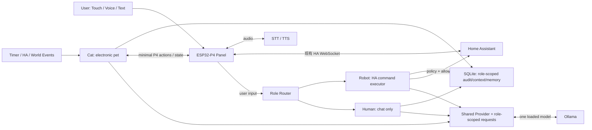

# P4 Home 本地 LLM Agent 化架构说明（审查优化版）

> Status: Current Architecture Baseline
> Target Project: `shenqislx/p4home`
> Target Stage: M7 / Local Voice, AI & Agent Runtime
> Review Date: 2026-08-24
> Execution Index: [docs/plans/README.md](./plans/README.md)

## 1. 结论

原方案的长期方向成立，以下原则建议保留：

- 通用 LLM 不运行在 ESP32-P4 上；
- LLM Provider 与 Agent Runtime 分离；
- LLM 只调用高层语义 Tool，不操作坐标和动画帧；
- World State 由真实执行层提供，不能依赖模型记忆；
- 动作必须有开始、完成、失败和取消反馈；
- Memory、Context 与实时 World State 分离；
- 自主行为由事件低频触发，禁止持续轮询模型。
- Role Router、Robot、Human、Cat 使用明确且不可互相提升的行为边界；可共用同一个已加载模型，
  但上下文、工具、推理参数、预算和审计必须按角色隔离。

但原方案不能直接作为实施规格。需要重点修正六点：

1. `Agent Runtime` 不应整体宣称“业务无关”，应拆成通用内核与 P4 Domain Adapter；
2. Home Assistant 控制应由 Agent Runtime 直连 HA，不应绕经 P4；
3. 当前角色能力只到“房间级移动”，第一版不能以“去沙发坐下”为验收；
4. P4 与 Agent 的 WebSocket 需要明确协议、幂等、重连、超时和状态对账；
5. M7 的语音链路、权限安全、可观测性和降级策略不能留到最后补；
6. 当前本地构建环境需先恢复可重复构建，再增加新的固件组件；
7. 单一 ToolCall 分数只能评价命令执行边界，不能代表路由、聊天和电子宠物三个产品角色。

推荐路线不是一次建成完整 Harness，而是：

```text
可重复构建
→ 协议契约与 Mock
→ 文本 Agent
→ P4 房间级动作闭环
→ 对象级 World Runtime
→ HA Tool
→ 语音
→ Memory
→ Autonomy
```

## 2. 当前项目与环境基线

本节只记录本次审查实际检查到的状态，避免把规划项写成已具备能力。

### 2.1 ESP32-P4 固件

| 项目 | 当前状态 | 对 Agent 化的影响 |
|---|---|---|
| 固件基线 | ESP-IDF v5.5.4 | M7 不应同步升级 IDF，避免扩大变量 |
| UI | LVGL 9.5.0、1024×600、RGB565 | 继续作为渲染层，不承载 Agent 推理 |
| 动效 | 共享 8 FPS 像素动效时钟 | Agent 只发语义动作，不介入逐帧控制 |
| 网络 | ESP32-C6 ESP-Hosted，Wi-Fi modem sleep 开启 | 新 WebSocket 必须容忍 DTIM 延迟、断线和重连 |
| HA | 已有 WebSocket 订阅、状态回刷和同步 `call_service` | 不再另造一条“Agent → P4 → HA”控制链 |
| Character | `idle / walk / sleep / doze`，支持按房间移动和对话气泡 | 暂无 `sit / look_at / interact / object anchor` |
| Gateway | 注册、状态快照、单条 command mailbox 骨架 | 单邮箱不足以承载 Agent Action Queue |
| 语音 | `audio_service`、`sr_service` 骨架存在；默认关闭 SR 与音频自检 | M7 需单独恢复并压测音频链路 |
| 存储 | 16 MiB Flash，32 MiB PSRAM | 足够新增轻量协议层，不适合存 Agent Memory |
| 分区 | 每个 app 分区 3 MiB，另有 storage/model 分区 | 协议与执行层有空间，仍需保留 OTA/资源余量 |

2026-08-15 使用独立 `SDKCONFIG` 与全新 build 目录完成干净构建，map 显示：

- 应用 image 统计为 `1,437,384 bytes`，生成的 `.bin` 为 `1,437,792 bytes`；
- Flash 中 `.text + .rodata` 为 `1,353,154 bytes`；
- 静态 DIRAM 使用 `296,378 / 576,464 bytes`，约 `51.41%`；
- 当前数字不包含完整运行期峰值，不能据此推断网络、LVGL、音频同时运行时的最低剩余堆。

因此结论是：Flash 和 PSRAM 余量不是当前主要矛盾，内部 RAM、任务栈、网络 buffer 和运行期碎片才是固件侧主要风险。

2026-08-15 已完成书房吸顶灯的隔离实机验收：单次 `call_service`、物理动作与受跟踪实体状态回刷均通过，代表性 M6 控制闭环已关闭。更广泛的米家设备覆盖仍为独立延期项。因此 Phase 0/1 可以继续推进不侵入固件主线的契约、Mock 与 Agent Runtime；Phase 2 若扩大设备覆盖，必须保持独立验证范围，避免同时调试两条实时控制链。

### 2.2 本地 AI 节点

本次检查到的开发机为：

- Mac mini，Apple M4 Pro，14 核，64 GB 统一内存；
- 仓库根目录与 Agent workspace 均以 `.nvmrc` 固定 Node.js `v24.19.0`；Node 22 仅保留为本机回退环境，不参与本 workspace；
- Python `3.14.3`；
- Ollama `0.32.15` 已安装；本地已有 `qwen3.8:27b-mlx`、`qwen3.6:35b-mlx`、`qwen3:8b` 等模型，
  考虑当前硬件的内存带宽约束，产品默认模型已于 2026-08-24 切回
  `qwen3.6:35b-mlx`；

该机器足以作为开发期 Agent/LLM 节点。Ollama 官方当前列出的 `qwen3:30b` 默认量化体积约 19 GB，64 GB 统一内存具备装载空间，但“能装载”不等于“满足交互延迟”。模型必须通过本项目的工具调用准确率和端到端延迟基准选择。

### 2.3 构建环境状态

Phase 0 已补齐 ESP-IDF v5.5.4 manifest 要求的
`riscv32-esp-elf esp-14.2.0_20260121`，并在不读取旧 CMake cache、使用独立
`SDKCONFIG` 的条件下完成一次全量构建。生成配置确认：

- `SLAVE_IDF_TARGET_ESP32C6=y`；
- `ESP_HOSTED_CP_TARGET_ESP32C6=y`；
- `ESP_HOSTED_P4_DEV_BOARD_FUNC_BOARD=y`；
- `ESP_HOSTED_SDIO_HOST_INTERFACE=y`；
- 配置日志没有 unknown Kconfig 或 attempt-to-assign 警告。

构建环境阻塞已经解除。精确提交 `b0aa443374360324a4a27dcc5a38c0a1849b0b45` 已在自托管
ESP32-P4 runner 完成构建、烧录与 7,200 秒串口采集；HA 全程 READY 且零重连、Pixel Home
heartbeat 稳定，heap/stack 无趋势性恶化，也未出现重启、panic、watchdog 或断言失败。workflow、
artifact 完整性与功能判定均已分别通过，因此可以把本候选的静态构建结论扩大为两小时实机稳定性
基线。正式证据见 Phase 0 计划中的
[run 31875576865](https://github.com/shenqislx/p4home/actions/runs/31875576865)。本阶段不更新
ESP-IDF 或 managed component 版本。

## 3. 优化后的系统边界



### 3.1 为什么 HA Tool 不应经过 P4

Agent Runtime 与 HA 都运行在高资源节点或局域网服务侧，直接调用 HA 有四个好处：

- 不占用 P4 的额外 JSON、任务栈和网络 buffer；
- P4 离线时，Agent 仍可执行家居任务；
- HA 继续作为物理家庭状态的唯一权威源；
- P4 通过现有 `state_changed` 订阅自然回刷，不需要 Agent 手工同步 UI。

P4 Tool 只负责 P4 独有能力，例如角色、屏幕、触摸、设备音频和面板状态。

### 3.2 五类权威状态

| 状态 | 权威来源 | 是否持久化到 Agent DB |
|---|---|---|
| 角色位置、姿态、当前动画 | P4 `world_service` | 只保存事件/快照用于诊断，不作为恢复真值 |
| 灯光、空调、传感器 | Home Assistant | 可缓存，HA 仍是真值 |
| 会话、任务、Action 关联 | Agent Runtime | 是 |
| 用户偏好与长期事实 | Memory Store | 是，必须带来源、置信度和更新时间 |
| 路由结果、语义分段与角色归属 | Role Router / Runtime | 是，保存输入版本、assignment 与 role_id |

## 4. 模块拆分

### 4.1 Agent 节点

“Runtime 业务无关”应调整为“Core 业务无关，Adapter 明确业务相关”。

```text
agent/
├── apps/
│   └── runtime/               # 进程入口、配置、健康检查
├── packages/
│   ├── core/                  # run loop、session、tool runtime、budget
│   ├── role-router/           # 单角色路由、后续语义分段与 assignment contract
│   ├── roles/                 # Robot/Human/Cat profile、context 与 inference policy
│   ├── contracts/             # Tool 与 Device Protocol schema
│   ├── provider-ollama/       # Ollama adapter
│   ├── domain-p4home/         # P4 tools、world projection、policy
│   ├── transport-panel-ws/    # P4 WebSocket server
│   ├── transport-ha/          # HA client 与 entity/service allowlist
│   ├── storage-sqlite/        # session、run、action、memory
│   └── observability/         # structured logs、metrics、trace id
└── tests/
    ├── contract/
    ├── integration/
    └── scenarios/
```

推荐主 Runtime 使用 TypeScript + Node.js 24 LTS：

- workspace 固定 Node.js 24.19+ 且限制在 Node 24 主版本，pnpm、测试与实际 Runtime 使用同一版本，避免双版本漂移；
- Ollama 提供官方 JavaScript/TypeScript 调用方式；
- WebSocket、JSON Schema、Zod 类型校验和前后端调试链较直接；
- 可避免把 Runtime 绑定到当前系统 Python 3.14 的生态兼容状态。

Whisper/faster-whisper/Piper 若使用 Python，建议作为独立进程或容器，并固定经过验证的 Python 3.11/3.12 环境，不与 ESP-IDF Python 环境混用。

### 4.2 P4 固件

不建议按原文新建模糊的 `firmware/ui`、`firmware/world` 顶层目录。当前仓库已经稳定采用 IDF component 结构，应继续沿用：

```text
firmware/components/
├── agent_transport/       # Device WebSocket、协议编解码、重连
├── world_service/         # Cat 真值、动作队列、动作状态机
├── ui_pages/              # 只渲染 world snapshot 与动画结果
├── gateway_service/       # 保留诊断快照；逐步退役单命令邮箱
├── ha_client/             # 保持现有 P4 UI 的 HA 读写链
└── voice_stream/          # 后续音频上行、TTS 下行
```

需要把当前 `ui_home_actor.c` 中的“状态决定”和“LVGL 渲染”逐步拆开：

- `world_service` 持有 Cat `room/activity/action_id`；
- `action_executor` 负责路径、时序、取消与完成条件；
- `ui_home_actor` 只把状态渲染成 sprite 与动画；
- 现有“断线打盹、全屋熄灯去睡觉”等规则先保留为本地 fallback policy，后续再决定是否由 Autonomy 替代。

## 5. Agent 核心对象模型

原方案只强调 Session，仍不足以描述长任务。建议固定以下对象：

```text
AgentProfile  角色、系统指令、推理参数、可用工具与权限
Interaction   一次原始用户输入或系统事件；可产生多个角色 assignment
RoutePlan     Role Router 输出的角色与语义分段，不携带执行权限
Session       单个角色的一段连续上下文；不同角色不得共用消息历史
Run           一个 assignment 在一个角色内的 Agent 执行
ToolCall      一次工具请求
Action        在外部世界中持续一段时间的执行
Event         可观察事实
Memory        可跨 Session 检索的长期事实
```

关键关系：

- 一个 Interaction 有一个 RoutePlan，可产生一个或多个角色 Run；
- 一个 Session 只属于一个 `role_id`，同一 Interaction 的多角色 Run 也分别进入各自 Session；
- 一个 Run 最多产生有限次 ToolCall；
- ToolCall 可立即完成，也可创建异步 Action；
- Action 的最终状态通过 Event 返回；
- Session 结束不代表尚在执行的 Action 可以失去归属。

### 5.1 Role Router 与三个角色

Role 不是三个常驻模型进程，也不是互相信任的“多 Agent 社会”。它们是同一个 Runtime 内三个
隔离的行为域，可复用同一个已加载的 Ollama 模型和 Provider，但每次请求必须重新绑定 RoleProfile：

| 边界 | 输入 | 输出与工具 | 初始推理参数 |
|---|---|---|---|
| Role Router | 当前用户输入与最小交互元数据 | 仅输出结构化 RoutePlan；无 Tool、无 Memory 写入 | temperature 0 |
| Robot | Router 分配的命令片段、必要 HA snapshot | 只执行受限 HA 命令并简短报告结果；不得闲聊或调用 P4 角色动作 | temperature 0 |
| Human | Router 分配的对话片段、Human 上下文 | 理解、共情和表达；没有执行型 Tool，不能代替 Robot 声称已执行 | 初始 temperature 0.7，可评测调节 |
| Cat | Timer、HA、World、task-complete 等事件 | 仅最小低风险 P4 World 能力；不得直接接收原始用户输入或写 HA | 初始 temperature 0.6，可评测调节 |

Router 只决定“谁处理哪段语义”，不能授予权限。即使 Router 错把对话片段交给 Robot，Robot 的
Tool Runtime 仍须执行 schema、allowlist、风险确认和幂等门禁；Human 永远没有执行型工具；Cat
永远拿不到 HA 写工具、用户原始 transcript 或 Robot/Human 的完整上下文。

首版 RoutePlan 使用数组结构但限制最多一个 assignment，以先验证单角色路由：

```json
{
  "schema_version": 1,
  "interaction_id": "interaction-001",
  "assignments": [
    { "role": "human", "segment": "我好累", "start": 0, "end": 3 }
  ]
}
```

Phase 4 在 Robot 已具备真实 HA Tool 后放开多个 assignment，并允许把“我好累，打开空调”拆成
Human 对话与 Robot 命令。语义分段必须保留原文 span、顺序和归属；Response Composer 只按策略
合并可展示文本与动作状态，不让 Human 文本覆盖 Robot 的真实执行结果，也不让一个角色继承另一
角色的工具观察。用户输入的允许目标只有 Human/Robot；未来若需要用户影响 Cat，应新增经过策略
审查的语义事件，而不是把原始用户文本直接注入 Cat。

### 5.2 共用模型时的隔离与调度

- 默认模型统一为 `qwen3.6:35b-mlx`，Provider 复用已加载实例，不为每个角色重复装载权重；
- 所有 Qwen 请求在 API 层显式设置 `think: false`；不依赖模型默认值，不允许任一角色覆盖开启；
- Router、Robot、Human、Cat 每次调用分别构造 messages、tools、temperature、预算和 AbortSignal；
- Provider 调度器初期串行或使用有界公平队列，用户 Robot/Human Run 优先于 Cat Run；
- Cat 推理可被用户输入、Robot 高优先级动作和资源压力取消；
- 缓存键必须包含 `role_profile_revision`，禁止跨角色复用 prompt/KV 或 Tool observation；
- 审计固定携带 `interaction_id / route_plan_id / role_id / run_id`，多角色响应可还原但不可串权。

## 6. Agent Loop：先简单、可预算、可中断

MVP 不需要单独的“复杂 Planner 服务”。先实现有预算的 ReAct/tool loop：

```text
Trigger
→ User input: Role Router / System event: fixed Cat route
→ Create one role assignment (Phase 4 may create several)
→ Build bounded context
→ Model decision
→ Direct response | Tool call
→ Validate policy and schema
→ Execute / wait for result
→ Append observation
→ Continue or finish
```

每个 Run 必须有硬限制：

- 最大工具轮次：建议初期 `4`；
- 最大 wall-clock deadline：按交互类型配置；
- 同一工具连续相同参数调用去重；
- 支持用户取消和高优先级事件中断；
- 模型输出必须通过 JSON Schema 校验；
- 超预算时给出明确失败，而不是无限继续推理。

Router 本身也是一个有独立 timeout、schema 和 token budget 的低温度推理步骤，但不是有 Tool 的
Agent Run。Router 失败、输出重叠 span 或返回未知角色时必须 fail closed；首版可以降级为 Human
纯文本澄清，绝不能因此默认落到 Robot。Timer/HA 事件触发 Cat 时不经过用户 Role Router，而由
Event Policy 先过滤、去重和限频后建立固定 `role=cat` assignment。

只有当场景确实需要“跨数分钟、可恢复、多分支计划”时，再增加显式 Planner 和持久化 Plan graph。

## 7. Model Provider 需要比 `chat()` 更完整

建议接口至少包含：

```typescript
interface ModelProvider {
  capabilities(): Promise<ModelCapabilities>;
  generate(request: ModelRequest, signal: AbortSignal): Promise<ModelResponse>;
  stream?(request: ModelRequest, signal: AbortSignal): AsyncIterable<ModelChunk>;
}
```

`ModelCapabilities` 至少描述：

- tool calling；
- structured output；
- streaming；
- thinking/reasoning 开关；
- context limit；
- 并行 tool call 支持；
- cancellation。

Runtime 启动时应做 capability probe，不能只靠配置文件声明模型支持某能力。Ollama 已原生支持 tool calling 与 JSON Schema structured outputs，应优先使用原生结构化调用，不再要求模型输出自定义伪 JSON 文本。

## 8. 模型、角色推理与评测策略

当前产品默认模型由用户选定为 `qwen3.6:35b-mlx`。Router、Robot、Human、Cat 共用同一个已加载
模型与 Ollama Provider，角色差异由 RoleProfile、上下文、Tool allowlist、temperature 和预算形成，
不得用“加载了同一个模型”推导出它们可以共享上下文或权限。所有 Qwen 请求统一
显式传入 `think: false`，thinking/reasoning 不是 RoleProfile 可调参数。`qwen3:8b` 只保留为功能 smoke；
任何 fallback 都必须重新通过对应角色门禁，不能在主模型失败时自动获得真实执行权限。

Phase 1 冻结的 32 场景 ToolCall exact 评测保留为命令执行型专项基线，更接近 Robot/受限执行器，
不再作为整个 Agent 的单一总分。角色化后至少维护五套互补证据：

| Eval | 核心问题 | 关键门禁 |
|---|---|---|
| Router | 单意图归属、拒绝、混合意图 span、路由稳定性 | 未知/重叠/遗漏分段 fail closed；不得授予 Tool |
| Robot | HA 命令抽取、参数、确认、执行结果忠实性 | 零越权执行；no-tool/高风险集合 100% 被策略拦截 |
| Human | 中文理解、对话质量、共情、事实性与边界表达 | 不能调用执行型 Tool，不能虚构“已打开/已关闭” |
| Cat | Timer/HA/World 事件到低风险行为、节制与可取消 | 不接收用户原文、不写 HA、不超频、不抢占用户 Run |
| End-to-end | RoutePlan → 各 Role Run → Response Composer | 每段归属正确，动作结果和文本不串角色，审计可还原 |

模型报告必须分别给出各角色指标和失败样本，不能把 Router 分类、Robot ToolCall、Human 主观质量、
Cat 长跑稳定性压成一个平均分。Human 需要盲评 rubric/成对偏好与越权红队；Cat 需要事件重放、
频率/取消/静默率；Router 在 Phase 4 增加“我好累，打开空调”一类 holdout 语义分割集。模型切换
最终是产品裁决，但报告必须揭示各行为边界的收益与退化。当前模型证据见
[Phase 1 model eval](../evidence/agent-phase-1/model-eval.md)。

常规交互不要直接使用模型宣称的最大上下文。MVP 建议将有效上下文控制在 8K～16K tokens，通过摘要、检索和 world snapshot 限制输入规模。

## 9. P4 Device Protocol

WebSocket 是合适的传输，但不是协议本身。第一版必须先冻结 envelope：

```json
{
  "protocol_version": 1,
  "message_id": "01J...",
  "correlation_id": "01J...",
  "device_id": "p4home-xxxx",
  "session_id": "session-optional",
  "seq": 42,
  "sent_at_ms": 1786761600000,
  "type": "action.request",
  "payload": {}
}
```

最低消息集合：

```text
device.hello
device.capabilities
world.snapshot
world.changed
user.text
action.request
action.accepted
action.started
action.completed
action.failed
action.cancel
heartbeat
error
```

协议约束：

- `message_id` 全局唯一；
- `action_id` 在断线重发时保持不变，P4 必须幂等；
- `seq` 用于发现丢失或乱序，不用作唯一标识；
- 重连后先交换 capabilities，再请求完整 world snapshot；
- 不尝试补放已过期的动画动作；
- 每个 action 带 deadline；
- 单帧 JSON 建议限制在 16 KiB 内；
- 二进制音频使用独立 frame/channel，不塞进 JSON Base64；
- 心跳与指数退避沿用现有 HA client 的成熟做法。

Event Bus 只作为进程内部解耦机制。跨 P4、Agent、HA 的边界应称为 Device Protocol/Event Stream，不能假设 in-process Event Bus 提供持久性或 exactly-once。

## 10. P4 Action Queue 与状态机

第一版建议队列容量固定为小值，例如 8，并明确背压：

```text
received
→ accepted | rejected
→ queued
→ started
→ completed | failed | cancelled | timed_out
```

规则：

- 只有 P4 可以声明角色动作真正完成；
- 相同 `action_id` 重发只能返回已有状态，不能重复执行；
- `cancel` 是请求，只有执行层确认后才算 cancelled；
- 新的高优先级用户指令可取消未开始的 autonomy action；
- 动作失败需返回稳定的机器码和简短人类可读说明；
- Action Queue 不等于 LLM Plan，队列中只放已验证、可执行的语义动作。

## 11. World Model：按现有能力分两级

### Level 1：房间级 MVP

当前已有六个房间定义和房间站立点，可先暴露：

```text
character.get_state()
character.go_to_room(room_id)
character.set_activity(idle | sleep)
character.say(text)
world.get_snapshot()
```

房间使用稳定 ID，不直接以可变中文显示名作为协议键：

```text
primary_bedroom
study
guest_room
entry
living_room
kitchen
```

Role 架构下第一个真实 Cat 验收不再使用用户原文，而使用 Event Policy 归一化后的：

> `CatEvent(room_target="living_room")`

用户说“去客厅待一会儿”只可路由给 Human/Robot，不能绕过边界直接注入 Cat；若未来支持用户影响
电子宠物，需新增经过 review 的 mediated Cat event。对象级 `sofa/sit` 仍须等待 Phase 3。

### Level 2：对象级 World Runtime

新增 `interaction_points` 后再提供：

```text
character.go_to(target_id)
character.sit(target_id)
character.look_at(target_id)
character.interact(target_id)
```

对象定义至少包含：

```text
object_id
room_id
anchor
supported_actions
occupied / available
animation_binding
```

不能先向模型公布 `sit("sofa")`，再期待执行层以后补齐。

## 12. Home Assistant Tool

Agent Runtime 直接维护独立 HA 连接，并复用现有 P4 工程已经验证过的原则：

- 只加载 allowlist 中的实体，不获取全量 `get_states`；
- 用 request id 关联结果；
- 订阅 `state_changed`；
- 控制完成以 HA result + 后续状态回刷为准；
- P4 和 Agent 使用不同凭证，便于撤销与审计。

初期 Tool 不要暴露任意 `call_service(domain, service, json)` 给模型。优先提供受限语义接口：

```text
home.get_entity(entity_id)
home.turn_on(entity_id)
home.turn_off(entity_id)
home.activate_scene(scene_id)
```

实体与 service 必须同时经过 allowlist 和 policy 校验。

## 13. Context 与 Memory

### 13.1 Context

当前产品 Runtime 的 message context 已按角色分别构建并设置独立预算，实际顺序为：

```text
Trusted System / Safety / frozen Role Profile
→ Untrusted Memory data message（可选、独立预算）
→ Retained Recent Conversation
→ Current Assigned Semantic Segment / Normalized Trigger Event
```

Tool Schemas 通过 provider 的独立 `tools` 字段传入，不伪装成 Memory message；相关 HA/P4
capability/world projection 位于当前 assignment/event 的有界 payload。Tool observation 只在后续
有限 tool round 中追加。Memory 不能挤占 trusted system、保留会话或当前输入。

Router 只接收当前用户输入和最小 locale/channel 元数据；Robot 不接收 Human 私聊历史；Human
不接收 HA token、Tool observation 或 Cat 内部事件；Cat 只接收经过 Event Policy 归一化的事件、
自身 world state 与专属预算。任何跨角色信息必须经过显式 projection，而不是拼接另一角色历史。

### 13.2 Memory

MVP 使用 SQLite 即可，建议从三类开始：

- `conversation_summary`：会话摘要；
- `user_fact`：明确或重复出现的用户偏好；
- `task_outcome`：重要任务结果与失败原因。

每条 Memory 至少包含：

```text
source
created_at
updated_at
confidence
expires_at
sensitivity
```

Memory 写入也应经过策略：模型不能因为一句玩笑就永久记录偏好，不能存储 HA token、Wi-Fi 密码、原始音频或不必要的敏感家庭状态。

当前 SQLite 数据库为 `PRAGMA user_version=4`，Memory record 使用独立的
`schema_version=1`；canonical record 已包含 `owner_role`、`visibility_scope`、
`source_interaction_id`、policy revision、expiry、lineage 与删除字段。Phase 6 已在同一
canonical dataset 上实现并确定性比较三种 projection：`private`、`shared_acl`、`hybrid`
（仅共享显式 ACL 批准的 `user_fact`）。

2026-08-24 用户已批准 visibility matrix v1 保持 `private`：`conversation_summary`、
`user_fact`、`task_outcome` 均保持 owner-role private。产品 Runtime 当前只接受工厂创建且冻结的
`private` runtime，跨角色产品召回禁用；`shared_acl/hybrid` 只存在于 evaluator-only
experimental boundary。确定性 fixture 全通过只证明各策略符合冻结矩阵，不表示共享方案更好。
任何未来放开都必须先创建新版本矩阵并经用户 review，不能沿用 v1 裁决隐式启用。

第一版不需要 Vector DB。先用结构化字段、FTS 和最近/显式标签检索，只有评测证明召回不足时再引入 embedding。

## 14. Voice Pipeline

原方案对 M7 的语音目标覆盖不足。建议将语音作为独立数据面：

```text
ESP-SR wake/AFE
→ P4 audio stream
→ STT
→ Role Router
→ Human / Robot Run
→ Response Composer
→ TTS
→ P4 playback
```

设计要求：

- 音频流与 Device JSON 控制消息分离；
- 支持 barge-in，用户再次说话时可取消 TTS 和当前低优先级 Run；
- 明确 VAD end-of-speech、STT timeout、TTS timeout；
- P4 断线或 AI 节点不可用时，固定离线命令仍可工作；
- 第一版先跑通文本 Tool Loop，再接入音频，避免同时调试模型、协议和声学链路。

若未来选择 Home Assistant Assist/Wyoming，应实现为 Voice Provider Adapter，而不是把 Agent Core 改写成 HA 专用逻辑。

## 15. 安全与权限

本系统具备控制真实家庭设备的能力，安全策略必须在 Tool Runtime 中执行，不能只写在 system prompt。

最低要求：

- Agent 服务只监听指定局域网接口，不直接暴露公网；
- P4 使用独立 device token，凭证不放 URL、不写日志；
- 条件允许时使用 `wss://` 和证书固定；若 MVP 使用明文 LAN WebSocket，必须限定在可信 VLAN；
- HA 使用独立低权限账号/token；
- 工具按 RoleProfile revision 授权；
- Router 无 Tool；Robot、Human、Cat 的 allowlist 分别校验，任何 RoutePlan 都不能扩大它；
- 锁、门、安防、购买、删除、温控极值等动作需要确认或禁用；
- HA entity 名称、日历内容和外部工具结果都按不可信输入处理，防止 prompt injection；
- 模型永远拿不到 HA token、device token 和原始配置文件；
- 所有执行型 Tool 记录 `run_id / tool_call_id / actor / target / result` 审计日志。

## 16. 故障与降级

| 故障 | 预期行为 |
|---|---|
| Agent Runtime 离线 | P4 保持现有 HA UI、触控控制和本地固定行为 |
| Ollama 离线/超时 | Runtime 快速失败；不生成猜测性 tool call |
| P4 离线 | Robot HA Tool 仍可工作；Cat 动作返回 device unavailable |
| HA 离线 | Cat Tool 可工作；Robot 家居 Tool 明确 unavailable |
| WebSocket 重连 | capabilities + full snapshot 对账，不盲目重放旧动作 |
| Action 超时 | Runtime 查询状态一次，随后失败或取消，不无限等待 |
| 模型输出不合法 | schema 校验失败并有限重试，绝不直接执行原始文本 |
| Router 不可用/输出不合法 | fail closed 到 Human 澄清文本；不默认执行 Robot Tool |
| Human 或 Robot 失败 | 只影响对应 assignment；Composer 明确部分失败，不伪造整体成功 |
| Cat 触发积压 | 合并/丢弃过期低优先级事件，不挤占用户请求 |

Autonomy 只能使用比用户交互更低的优先级；任何网络重连、进程重启都不能自动补执行过期的自主动作。

## 17. 性能与稳定性门禁

### 17.1 固件侧

进入每个阶段前后记录同一套基线：

- app image size；
- static DIRAM；
- 启动后 internal/PSRAM free heap；
- minimum free heap；
- largest internal block；
- Agent WebSocket task stack high-water mark；
- HA + Agent 双 WebSocket 下的断线重连次数；
- UI 8 FPS heartbeat 是否持续稳定；
- 音频启用后的丢帧和 underrun。

建议门禁：

- app image 保持在 3 MiB 分区的 75% 以下，超出需专项评审；
- static DIRAM 保持在 65% 以下；
- Agent 功能引入后 minimum internal heap 相对基线下降不超过 20%，或给出明确预算解释；
- 断开/恢复 Agent 100 次无重启、无重复动作；
- Agent 离线 2 小时不影响 P4 ↔ HA 主链路；
- 队列满时明确 reject，不崩溃、不静默丢动作。

这些是工程门禁，不代表当前已经达到；运行期 heap 基线需在新组件开发前通过实机串口重新采集。

### 17.2 Agent 节点侧

先测量再选模型，至少记录：

- model load 时间与常驻内存；
- 首 token / 首 tool call 延迟；
- tool call schema 成功率；
- 每个 Run 的 prompt/completion tokens；
- 队列等待时间；
- timeout、cancel、provider error 比例；
- STT、LLM、Tool、TTS 分段耗时；
- 按 role_id 记录 Router、Robot、Human、Cat 的队列、tokens、取消和错误，禁止只看进程总平均；
- 多角色 Interaction 记录路由、并行/串行等待、首个用户可见响应与全部 assignment 完成时间。

建议的体验目标：

- 非 LLM 的 P4 action accepted：局域网内 `p95 < 300 ms`；
- 模型到首个有效 tool call：选定默认模型后 `p95 < 4 s`；
- 简单 Cat event 从入队到 P4 开始执行：`p95 < 5 s`；
- 具体语音目标在 STT/TTS 接入后另行测定，不用单一总耗时掩盖慢段。

## 18. 分阶段实施计划

本节定义阶段边界；可执行任务、依赖、验证证据和退出门禁以 [当前工作计划索引](./plans/README.md) 及其 Phase plan 为准。架构文档不记录每日进度，避免架构原则与执行状态相互污染。

### Phase 0 — Baseline & Contract

归档计划：[Phase 0 — Build Baseline & Contract](./archive/plans/agent/2026-08-15-agent-phase-0-baseline-contract-plan.md)

交付：

- 恢复 ESP-IDF v5.5.4 可重复干净构建；
- 固化 ESP32-C6 Hosted 配置；
- 采集固件运行期 heap/stack 基线；
- 冻结 Device Protocol v1 与 Tool Schema v1；
- 建立 P4 simulator/fake transport 合约测试。

退出条件已于 2026-08-15 满足：新机器或干净 build 目录可按文档一次构建成功；协议 Mock 测试通过，
Device Protocol v1 与 Tool Schema v1 已冻结。

### Phase 1 — Text Agent Runtime

归档计划：[Phase 1 — Text Agent Runtime](./archive/plans/agent/2026-08-15-agent-phase-1-text-runtime-plan.md)

交付：

- TypeScript workspace；
- OllamaProvider；
- Session、Run、有限 Tool Loop；
- SQLite；
- mock character tool；
- 结构化日志与 eval 场景。

退出条件：文本场景中 tool schema 成功率达到约定阈值，取消和超时可验证。该阶段是通用 Role Loop
与命令执行型评测基线，不宣称已经具备产品级 Role Router 或完整 Robot/Human/Cat。

### Phase 2 — Role Runtime & P4 Room-level Cat World

归档计划：[Phase 2 — Role Runtime & P4 Room-level Cat World](./archive/plans/agent/2026-08-15-agent-phase-2-p4-room-world-plan.md)

交付：

- Role Router v1、RoutePlan/Interaction contract、单 assignment 路由；
- Robot/Human/Cat 三个 RoleProfile、上下文隔离、推理参数与审计关联；
- Human 无执行 Tool 的基础文本对话；Robot 先使用 Mock/不可用反馈，真实 HA Tool 在 Phase 4 接入；
- `agent_transport`；
- `world_service`；
- action queue/state machine；
- Cat 的 `go_to_room / set_activity / say / get_state` 最小 P4 World 能力；
- 断线重连与 snapshot 对账。

退出条件：

```text
Test Cat Event: room_target=living_room
→ character.go_to_room("living_room")
→ accepted / started / completed
→ Cat Run 获得真实完成结果
```

同时必须证明用户输入只会路由到 Human/Robot，Cat 不接收用户原始文本；Human 不能执行 Tool；
RoutePlan 非法时不会降级执行命令。

退出条件已于 2026-08-20 满足，并通过用户最终 review；Phase 2 已完成归档。

### Phase 3 — Cat Object-level World

执行计划：[Phase 3 — Object-level World（已归档）](./archive/plans/agent/2026-08-15-agent-phase-3-object-world-plan.md)

交付：Cat 对象注册表、interaction points、`go_to/sit/look_at/interact` 与对应动画。

退出条件：归一化 Cat event 可让 Cat “去沙发坐下”，且模型不接触坐标、用户原文不直接进入 Cat。

2026-08-20 已获用户授权启动；3A Object Registry Contract、3B P4 Object Runtime 与 3C Cat
Object Event & Role Boundary 已完成。3D 最终实机 run `32382940058` 已通过 manifest-first artifact
判定：对象动作链、重连 snapshot、取消、Agent 离线后对象释放、HA/UI、资源与 240 秒 8 FPS 均通过。
2026-08-20 用户最终 review 通过，Phase 3 已完成并归档；对象级执行 Tool 仅属于 Cat RoleProfile。

### Phase 4 — Robot Home Assistant Tool & Multi-role Split

执行计划：[Phase 4 — Home Assistant Tool（已归档）](./archive/plans/agent/2026-08-15-agent-phase-4-ha-tool-plan.md)

交付：Robot 直连 HA、读侧 allowlist、低风险写侧、状态订阅、审计；RoutePlan 放开多个 assignment，
实现语义 span 分割、Human + Robot 多角色响应和确定性 Response Composer。

退出条件：Robot 控制真实实体后，Robot 与 P4 都从 HA 回刷到一致状态；“我好累，打开空调”可由
Human 回应情绪片段、Robot 处理命令片段，权限和执行结果不串角色。

2026-08-23 用户最终 review 通过，Phase 4 已完成并归档；4A–4E 技术与真实环境门禁均已关闭。

### Phase 5 — Role-aware Voice

执行计划：[Phase 5 — Voice Pipeline](./plans/2026-08-15-agent-phase-5-voice-plan.md)

交付：ESP-SR/AFE 恢复、音频上行、STT、Role Router、分角色 TTS/Response Composer、barge-in、
语音状态 UI。

退出条件：本地唤醒到一次家控对话闭环稳定完成。

2026-08-23 已获用户明确授权启动。Phase 5 拆分为 5A 音频/ESP-SR 基线与 Voice contract、5B 独立
二进制通道、5C STT/统一 Router、5D 分角色 TTS 与 barge-in、5E 安全/评测/实机总门禁。5A 的
Voice Protocol v1、自动化硬件、真实 wake 与固定命令动作门禁已通过；5B 最终 run `32627837273`
证明真实 P4 PCM 有界抵达 Agent fake sink、丢帧 0，并保持 HA、固定命令与稳态 UI 主链，独立 review
后技术门禁关闭。5C 最终 run `32635742553` 已证明真实 P4 中文输入经固定 MLX STT 后只进入统一
Human Runtime，transcript 哈希、SQLite 审计、Cat 零泄漏和原始音频不保留均满足门禁。P4 可听
startup tone 人工观察待补；5D 分角色 TTS、播放与 barge-in 技术门禁已通过。5E 当前候选 commit
`8432641` 的 `phase5e_ui` run `33321298417` 已按 manifest-first 协议通过真实 P4、模型/HA/STT、
读/写恢复/聊天、三次 UI ACK 和 artifact 隐私门禁，音频明确 deferred。P4 UI 三轮文本、雨动画
观感和扬声器可听仍待人工观察，因此保持 `pending_real_environment`，尚未打开默认 SR。

### Phase 6 — Memory

归档计划：[Phase 6 — Memory](./archive/plans/agent/2026-08-15-agent-phase-6-memory-plan.md)

交付：摘要、用户事实、任务结果、检索与删除机制；比较角色私有、共享 ACL、共享用户事实 +
角色私有记忆三种方案，并由评测与用户 review 决定最终可见性矩阵。

退出条件：跨 Session 偏好召回可评测，错误记忆可追溯和删除。

2026-08-24，6A–6E 本地实现与确定性门禁完成；补齐 6H P4 Cat + Memory 和 6I
quota/retention 后，2026-08-25 用户最终 review 通过、接受明确延期项并关闭 Phase 6。
Memory contract/SQLite、确定性写入与冲突/删除、独立 context budget、private 产品召回和三种
visibility projection 的 evaluator 均有量化证据；`pnpm gate:phase6` 在 Node `v24.19.0` /
pnpm `11.19.0` 下通过。用户已批准
[visibility matrix v1](../evidence/agent-phase-6/visibility-matrix.md) 保持 `private`；三类
Memory 均为 owner-role private，`shared_acl/hybrid` 继续 evaluator-only。三策略 deterministic
通过只说明各自实现符合冻结矩阵，不说明共享更优。2026-08-24，6F 真实 35B
grounded/prompt-injection 门禁已通过；6G 真实 HA 只读门禁证明 Memory 不覆盖 HA
真值且无 service call，并已在干净工作树上绑定提交。6I APFS 权限、WAL/NORMAL、受控进程终止、
完整性/损坏拒绝、在线备份和 checkpoint 冷备份子门禁已从干净工作树复跑通过并绑定提交
`899b746`。6H P4 Cat run `32819132030` 已证明 P4 snapshot 保持 World 真值且 artifact 隐私
审计通过；DB/WAL/index quota 与分类 retention revision 1 已获批并实现。代表性家庭数据、Voice +
Memory、家庭身份模型、SQLite 真实断电、加密/secure-delete 经用户决定延期；Phase 5 仍为
`pending_real_environment`。Phase 7 已于 2026-08-26 获得授权并推进，当前状态见下节；Phase 6
延期项仍未验证。确定性 FTS 已满足当前冻结场景，因此 Vector DB 当前不立项，但真实
数据证据不足，后续仍可在独立计划中重新评估。

SQLite 删除保证仅覆盖产品查询和数据库逻辑对象；删除前备份、旧 WAL 帧、APFS snapshot 与
SSD 物理页不在该保证内。具体边界见
[SQLite 删除与残留边界](./sqlite-deletion-remnants.md)，介质级 secure-delete 仍保持 `pending`。

### Phase 7 — Cat Autonomy

执行计划：[Phase 7 — Autonomy 归档](./archive/plans/agent/2026-08-15-agent-phase-7-autonomy-plan.md)

交付：Cat 的 Timer/HA/World/task-complete 低频 trigger、Event Policy、quiet hours、budget、用户总
开关、审计和取消。Cat 不直接接收用户输入、不写 HA，并永远低于 Robot/Human 用户 Run 优先级。

退出条件：长跑不频繁唤醒模型，不抢占用户动作，不在重启后补执行过期任务。

2026-08-26 用户明确授权启动 Phase 7，并要求先完成 feature 编码。7A Runtime 已建立四类严格
trigger、低频 Event Policy、独立 Cat `role-profile/v6`、用户抢占、暂停/关闭和审计查询；7B 本地
7 天长跑、频率/误触发/抢占 gate 已通过。7C1 产品启动装配、离线/重连门禁、loopback 控制面和
独立 bugs review 已完成。旧 run `33056257943` 的上传产物后经复核发现 entity 残留并已删除，不能
作为通过证据。2026-08-27，修复提交 `e8de907` 对应的 7C 专用 `phase7_autonomy` run
`33061620203` 通过 manifest-first 技术门禁：真实固定模型仅调用 2 次，Timer 与隔离 HA allowlist
投影各完成一个 P4 action，重连 snapshot 不回退；Agent `RobotHaClient` 与 P4 内置 HA client
分别记录零 `call_service` dispatch，pause/disabled 各 60 秒零新增调用，120 秒资源采样稳定；
artifact 审计覆盖 36 个 entity value、脱敏 43 处且确认凭据/entity 零残留。HA 零 dispatch 结论不
覆盖其他客户端或 HA 服务端全局写入；该 run 也不声称真实家庭 HA 状态发生变化或代表
unrestricted production deployment。2026-08-27 用户最终 review 通过，Phase 7 已完成并归档；
上述边界继续有效，未验证项不会因归档而变成通过。

## 19. MVP 验收清单

房间级 MVP 至少满足：

- [ ] Agent Runtime 不运行在 P4；
- [ ] P4 与 HA 原有 UI/控制链不因 Agent 离线而失效；
- [ ] 模型通过原生 tool calling 产生合法参数；
- [ ] 不存在的房间或动作不会下发；
- [ ] 同一 `action_id` 重发不会重复执行；
- [ ] P4 返回 accepted、started、completed/failed；
- [ ] 断线重连后 world snapshot 一致；
- [ ] 队列满、动作超时、用户取消均有确定结果；
- [ ] 100 次连续动作无崩溃、无重复执行；
- [ ] 日志可由 `run_id → tool_call_id → action_id` 完整追踪；
- [ ] 日志可由 `interaction_id → route_plan_id → role_id → run_id` 还原路由与角色归属；
- [ ] Router 无 Tool，Human 无执行 Tool，Robot 只有 HA Tool，Cat 只有最小 P4 World Tool；
- [ ] Cat 不接收原始用户输入，Timer/HA 事件经过 Event Policy 才能触发；
- [ ] 固件 image、DIRAM、heap、stack 与 UI 帧率门禁通过。

## 20. 暂不实施

以下内容不进入第一版：

- 独立模型进程组成的对等多 Agent 协商；Role Router 与隔离角色属于当前范围；
- 独立复杂 Planner；
- Vector DB；
- 任意 HA `call_service`；
- 浏览器、Shell、文件系统等高权限通用工具；
- 无限制并行推理；
- 逐帧或坐标级 LLM 控制；
- 高频 autonomy loop；
- 将完整 HA 状态、完整聊天历史或原始音频长期保存。

## 21. 最终架构原则

优化后的边界可浓缩为：

```text
LLM：提出结构化意图
Role Router：把用户语义分配给 Human/Robot，不授予权限
Robot：只执行受策略约束的 HA 命令
Human：只负责对话理解和表达，不执行真实动作
Cat：只由低频事件驱动并使用最小 P4 World 能力
Agent Core：按角色控制 Run 的预算、上下文和工具生命周期
P4Home Domain：定义允许做什么及安全策略
P4 World Service：决定角色动作如何执行并报告真实结果
Home Assistant：维护物理家庭状态真值
UI：渲染结果，不替 Agent 做语义决策
```

“小人是 Cat 的身体”可以继续作为产品愿景；Robot 的身体是受限 HA Tool，Human 没有执行身体。
Cat 的工程边界必须落实为：

> 一个具有版本化能力描述、幂等动作协议、可取消执行状态机和真实状态反馈的 P4 World Adapter。

只有完成这些约束，Embodiment 才不是比喻，而是可测试、可恢复、可演进的软件边界。

## 22. 参考

- [Ollama Tool Calling](https://docs.ollama.com/capabilities/tool-calling)
- [Ollama Structured Outputs](https://docs.ollama.com/capabilities/structured-outputs)
- [Ollama Qwen3 Model Library](https://ollama.com/library/qwen3)
- [Home Assistant WebSocket API](https://developers.home-assistant.io/docs/api/websocket/)
- [Home Assistant Authentication API](https://developers.home-assistant.io/docs/auth_api/)
