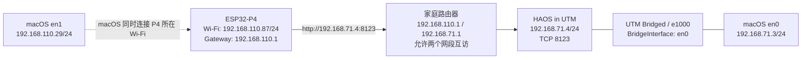

# UTM 桥接网络与 ESP32-P4 访问 Home Assistant 操作手册

本文记录 `p4home` 项目已经验证成功的网络方案，用于在 macOS 的 UTM 虚拟机中运行 Home Assistant OS，并让 ESP32-P4 面板访问 Home Assistant 的 `8123` 端口。

本文重点是网络连通性。HA 安装、实体接入和 P4 固件业务功能不在本文展开。

## 1. 已验证的网络拓扑

成功环境不是“UTM 与 P4 位于同一子网”，而是两个子网经过家庭路由器互通：



成功基线参数如下。IP 地址可能由 DHCP 重新分配，建议在路由器中做静态租约。

| 项目 | 成功环境参数 |
|---|---|
| UTM 后端 | QEMU，aarch64 `virt` |
| HAOS 镜像 | `haos_generic-aarch64-17.0.qcow2` |
| UTM 网络模式 | `Bridged` |
| UTM 桥接接口 | `en0` |
| 虚拟网卡型号 | `e1000` |
| HA 虚拟机 MAC | `16:70:5F:6F:E6:AE` |
| HA 地址 | `192.168.71.4:8123` |
| Mac 的 HA 侧接口 | `en0 = 192.168.71.3/24` |
| Mac 的 P4 侧接口 | `en1 = 192.168.110.29/24` |
| P4 地址 | `192.168.110.87/24` |
| P4 默认网关 | `192.168.110.1` |
| HA 侧网关 | `192.168.71.1` |

## 2. 前置条件

开始前确认：

- UTM 已安装，HAOS 虚拟机可以正常启动。
- Mac 的 `en0` 已连接到 `192.168.71.0/24` 网络。
- P4 接入的 Wi-Fi 位于 `192.168.110.0/24`。
- 家庭路由器同时管理这两个网段，并允许二者互访。
- 路由器或 AP 没有开启会阻断 P4 的访客网络隔离、AP isolation 或 VLAN ACL。
- HAOS 防火墙和上游网络允许访问 TCP `8123`。

先在 Mac 上确认接口地址：

```bash
ifconfig en0
ifconfig en1
netstat -rn -f inet
```

不要只根据 `en0`、`en1` 名称猜测物理接口。不同 Mac 上接口编号可能不同，应以实际 IP、连接方式和 `ifconfig` 输出为准。

## 3. 配置 UTM 桥接网络

### 3.1 完全关闭虚拟机

必须先关闭 HAOS 虚拟机，而不是仅暂停或保存状态。UTM 在虚拟机运行时可能不允许修改网络模式。

### 3.2 修改网络设备

在 UTM 中选中 HAOS 虚拟机，进入“编辑/设置”，找到 Network，按以下参数设置：

1. Network Mode 选择 `Bridged`。
2. Bridged Interface 选择实际连接 `192.168.71.0/24` 的接口；成功环境为 `en0`。
3. Emulated Network Card 选择 `Intel Gigabit Ethernet (e1000)`，底层配置值为 `e1000`。
4. 关闭“Isolate from Host”，底层配置值应为 `false`。
5. 保持虚拟机 MAC 地址稳定；成功环境为 `16:70:5F:6F:E6:AE`。
6. 保存配置并启动虚拟机。

部分无线网卡或 AP 不允许同一无线连接后面出现额外的虚拟机 MAC，桥接到 Wi-Fi 时可能无法取得地址。成功环境使用 `en0` 桥接，再由路由器完成到 P4 Wi-Fi 网段的转发。

当前成功环境的 UTM 配置对应：

```text
Mode = Bridged
BridgeInterface = en0
Hardware = e1000
IsolateFromHost = false
MacAddress = 16:70:5F:6F:E6:AE
```

### 3.3 关于端口转发

桥接模式下，P4 直接访问 HAOS 的地址 `192.168.71.4:8123`，不经过 Mac 的端口转发。

UTM 配置中即使残留 `8123 -> 8123` 的 Port Forward 记录，也不是本方案的实际数据路径。不要用端口转发代替桥接和路由器跨网段配置。

## 4. 获取并固定 HAOS 地址

HAOS 启动后，通过以下任一方式确认地址：

- HAOS 控制台显示的 IPv4 地址。
- 路由器 DHCP 客户端列表。
- 根据虚拟机 MAC 地址 `16:70:5F:6F:E6:AE` 查找租约。
- 在 Mac 上查看 ARP：

```bash
arp -an | grep '192.168.71.4'
```

成功环境应看到类似：

```text
? (192.168.71.4) at 16:70:5f:6f:e6:ae on en0
```

建议在路由器中将该 MAC 固定分配为 `192.168.71.4`。如果 HA 地址变化，P4 NVS 中保存的 HA URL 也必须同步修改。

## 5. 配置路由器跨网段访问

这是本方案最容易遗漏的一步。

P4 的 `192.168.110.87` 与 HAOS 的 `192.168.71.4` 不在同一子网，因此 P4 会把访问 HA 的数据交给 `192.168.110.1`。路由器必须把流量转发到 `192.168.71.0/24`，返回流量也必须能回到 `192.168.110.0/24`。

路由器侧至少应满足：

- 存在 `192.168.110.0/24` 与 `192.168.71.0/24` 的三层路由。
- 允许 `192.168.110.0/24 -> 192.168.71.4:8123/TCP`。
- 允许已建立连接的返回流量。
- P4 所在 SSID 不是禁止访问内网的访客网络。
- 没有 VLAN ACL 阻断两个网段。

本方案不依赖 macOS 的 IP forwarding。P4 的流量经过家庭路由器，不经过 Mac 用户态转发。

如果路由器无法在两个网段间转发，优先选择以下方案之一：

1. 将 HAOS 和 P4 放到同一个局域网。
2. 给路由器增加明确的跨网段放行规则。
3. 在硬件与 UTM 支持的前提下，把 UTM 桥接到 P4 所在的物理网络接口。

不要仅在 Mac 上增加到 `192.168.71.0/24` 的静态路由；这不能自动解决 P4 到 HA 的路径。

## 6. 在 Mac 上验证 HAOS

### 6.1 验证 UTM 桥接接口

UTM 启动后检查：

```bash
ifconfig bridge100
```

成功环境中 `bridge100` 为 active，成员包含：

```text
member: vmenet0
member: en0
```

### 6.2 验证路由和端口

```bash
route -n get 192.168.71.4
nc -vz 192.168.71.4 8123
curl --noproxy '*' --connect-timeout 3 -I http://192.168.71.4:8123/
```

如果开发机设置了 `HTTP_PROXY` / `HTTPS_PROXY`，普通 `curl` 可能错误地把内网请求发给代理。验证内网 HA 时应使用 `--noproxy '*'`，或把两个内网网段加入 `NO_PROXY`：

```bash
export NO_PROXY="localhost,127.0.0.1,192.168.71.4,192.168.110.87"
```

注意：Mac 同时直连 `192.168.71.0/24` 时，Mac 能访问 HA 只能证明 UTM/HA 在 HA 侧网络正常，不能证明路由器已经允许 P4 跨网段访问。最终必须以 P4 日志为准。

## 7. 配置 P4 的 HA 地址

P4 应使用 HAOS 的直接地址：

```text
http://192.168.71.4:8123
```

HA client 会自动转换到 `/api/websocket`。使用 `http://` 时，TLS 校验开关不参与连接；只有 `https://` / `wss://` 才使用 TLS 设置。

配置项位于：

```text
Component config -> P4Home Settings Service
```

关键配置：

- `P4HOME_HA_URL`
- `P4HOME_HA_TOKEN`
- `P4HOME_HA_VERIFY_TLS`
- `P4HOME_HA_SEED_NVS_ON_BOOT`

本地配置入口：

```bash
cd firmware
. ../scripts/activate-idf-v5.5.4.sh
idf.py menuconfig
```

安全要求：

- 使用 HA Long-Lived Access Token。
- 不要把 token 写进操作手册、串口日志或 Git 提交。
- 提交前检查 `firmware/sdkconfig`，确认没有意外提交 token。

`settings_service` 的 Kconfig 种子只会填充 NVS 中不存在的 URL/token，不会覆盖已有值。因此：

- 新设备或空 NVS 可以通过 Kconfig seed 初始化。
- 已配置设备即使修改 Kconfig，旧 URL 仍可能继续生效。
- 若没有其他配置入口，需要在确认可接受丢失全部设备设置后执行 `idf.py erase-flash`，再用新的本地配置重新烧录。

`erase-flash` 会清空整个 Flash，包括 NVS，不能作为普通重烧录步骤使用。

## 8. 从 P4 串口验证跨网段通讯

启动串口监视：

```bash
cd firmware
. ../scripts/activate-idf-v5.5.4.sh
idf.py -p /dev/cu.usbserial-210 monitor
```

串口号因机器而异，可先查看：

```bash
ls -l /dev/cu.*
```

成功时应依次看到：

```text
network_service: wifi got ip=192.168.110.87
p4home_main: wifi started=yes connected=yes has_ip=yes ip=192.168.110.87
ui_dashboard: dashboard_value_ready ... value_present=yes
diagnostics: ha_summary state=READY ... initial=<非零> ...
```

当前固件的 HA worker 有启动延迟，启动阶段出现以下内容并不代表最终失败：

```text
VERIFY:ha:ws_connected:PENDING_DELAY
VERIFY:ha:authenticated:PENDING_DELAY
VERIFY:ha:subscribed:PENDING_DELAY
VERIFY:ha:initial_states_loaded:PENDING_DELAY
```

继续观察约 30～60 秒。最终应看到 `ha_summary state=READY`、初始实体数非零，并且 dashboard 实体出现 `value_present=yes`。

已验证记录：

- `2026-07-15`：P4 为 `192.168.110.87`，成功跨网段访问 `192.168.71.4:8123`，HA 进入 `READY`，30 个实体完成初始状态拉取。
- `2026-07-16`：同一网络路径再次验证，HA 进入 `READY`，35 个实体完成加载，P4 持续运行无崩溃或重启。

## 9. 控制闭环验证

网络和订阅正常后，再验证控制路径：

1. 等待 P4 日志进入 `ha_summary state=READY`。
2. 在面板上操作一盏测试灯或一个空调实体。
3. 确认 HA 接受 `call_service`。
4. 确认实际设备动作。
5. 确认 HA 随后发送 `state_changed`。
6. 确认 P4 卡片状态回刷。

只有以上链路全部成立，才算完成：

```text
P4 -> 路由器跨网段转发 -> UTM/HA -> 实际设备 -> HA state_changed -> P4 UI
```

## 10. 常见故障排查

| 现象 | 可能原因 | 处理方法 |
|---|---|---|
| UTM 中没有 Bridged 接口可选 | 虚拟机未完全关机，或宿主接口不可用于桥接 | 完全关闭虚拟机；确认物理接口已启用 |
| HAOS 没有 IPv4 地址 | 选错桥接接口、DHCP 不可达、虚拟网卡兼容性问题 | 核对 `BridgeInterface`；使用 `e1000`；检查路由器 DHCP |
| `bridge100` 不含目标物理接口 | UTM 没有桥接到预期接口 | 关闭虚拟机并重新选择接口 |
| ARP 中能看到 HA，但 `8123` 拒绝连接 | HA Core 尚未启动或服务异常 | 等待 HAOS 完成启动；检查 HA Core 状态 |
| Mac 能访问 HA，P4 一直 `CONNECTING` | 两网段没有路由/ACL 放行，或 P4 HA URL/token 错误 | 检查路由器跨网段策略；核对 P4 NVS 配置 |
| P4 能联网但无法访问 HA | P4 位于访客 Wi-Fi、AP isolation、VLAN ACL 阻断 | 改用允许访问内网的 SSID 或调整 ACL |
| 修改 Kconfig URL 后仍连旧地址 | NVS 已有 URL，seed 不覆盖 | 通过设置 API 更新；或谨慎清空 NVS 后重新 seed |
| `curl` 报错连接本机代理端口 | 内网请求被代理环境变量劫持 | 使用 `curl --noproxy '*'` 或配置 `NO_PROXY` |
| 启动时 HA 显示 `PENDING_DELAY` | 固件设计的 HA 延迟启动 | 继续观察 30～60 秒，以最终 `state=READY` 为准 |
| IP 变化后 P4 失联 | DHCP 地址未固定 | 按虚拟机 MAC 配置静态 DHCP 租约 |

## 11. 快速复核清单

- [ ] UTM 虚拟机已完全关闭后修改配置
- [ ] Network Mode 为 `Bridged`
- [ ] 桥接到实际 HA 侧物理接口，成功环境为 `en0`
- [ ] 虚拟网卡为 `e1000`
- [ ] HAOS 获得 `192.168.71.4/24`
- [ ] HAOS MAC 保持为 `16:70:5F:6F:E6:AE` 或已更新 DHCP 绑定
- [ ] Mac 可直连 `192.168.71.4:8123`
- [ ] 路由器允许 `192.168.110.0/24` 访问 `192.168.71.0/24`
- [ ] P4 获得 `192.168.110.87/24` 或同网段有效地址
- [ ] P4 HA URL 指向 `http://192.168.71.4:8123`
- [ ] 串口最终出现 `ha_summary state=READY`
- [ ] dashboard 实体出现 `value_present=yes`
- [ ] 实际控制后设备动作和 UI 状态回刷均正常

## 12. 配置核对依据

本手册根据以下证据整理：

- UTM 虚拟机 `config.plist` 中的 `Mode=Bridged`、`BridgeInterface=en0`、`Hardware=e1000` 和虚拟机 MAC。
- macOS 当前接口、路由表、`bridge100` 与 ARP 信息。
- 项目 `2026-07-15` 和 `2026-07-16` 的 P4 实机串口验证记录。
- [项目里程碑](./project-milestones.md) 和 [HA call_service 历史联调记录](./archive/plans/legacy/2026-05-21-ha-client-call-service-writeback-plan.md)。

接口名、IP 地址和串口号都属于成功环境实例。迁移到其他 Mac、路由器或开发板时，应重新识别，不应机械照抄。
